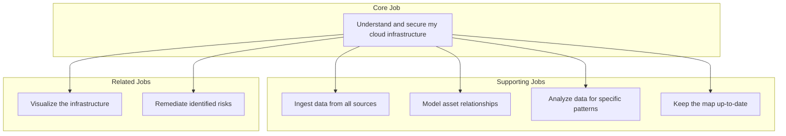
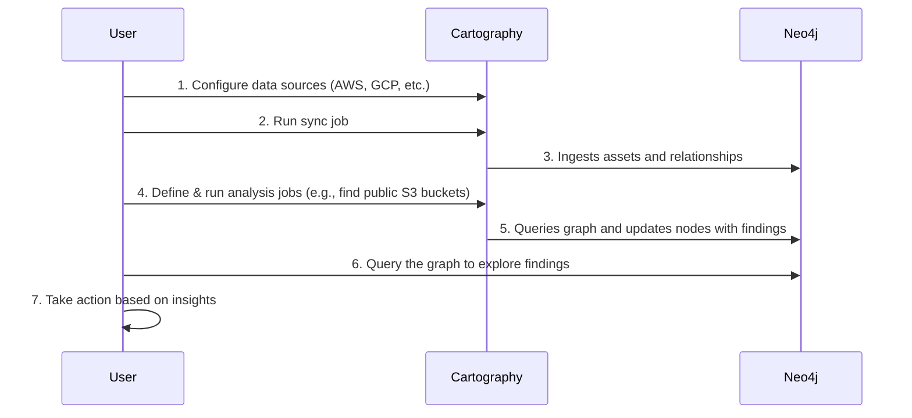

# Jobs to be Done (JTBD): Cartography

This document outlines the "Jobs to be Done" that customers "hire" Cartography to perform. It is based on an analysis of the product's source code and existing documentation.

## 1. Core Job

The primary job that customers hire Cartography for is:

> When I am responsible for a complex and evolving cloud infrastructure, I want to **have a unified, up-to-date map of all my assets and their relationships**, so I can **quickly understand our security posture, identify dependencies, and make informed decisions**.

---

## 2. Job Map

This diagram illustrates the relationship between the core job and the related jobs that support it.

---

## 3. Desired Outcomes

These are the measurable results that customers want to achieve by using Cartography.

### Core Job Outcomes

*   **Reduce time-to-insight:** Decrease the time it takes to answer complex questions about the infrastructure from days/weeks to minutes.
*   **Increase visibility:** Eliminate blind spots by having a single pane of glass for all assets, across all monitored environments.
*   **Improve security posture:** Reduce the number of publicly exposed assets and other high-risk misconfigurations.
*   **Accelerate incident response:** Decrease the time it takes to understand the blast radius of a compromised asset or user.
*   **Improve operational efficiency:** Reduce the time and effort required to perform manual infrastructure audits.

### Supporting Job Outcomes

*   **Data Ingestion:**
    *   Minimize the effort required to add new data sources.
    *   Ensure data is ingested in a timely and predictable manner.
*   **Data Analysis:**
    *   Minimize the effort to create new, custom analyses.
    *   Ensure that analysis results are consistently accurate and not based on stale data.

---

## 4. The Big Picture: Getting the Job Done

This diagram shows the steps a user takes to accomplish the core job with Cartography.

---

## 5. Related Jobs

### Supporting Jobs

These are jobs that make it easier to accomplish the core job.

*   **Ingest Data from All Sources:** When I start using the tool, I want to connect it to all my cloud providers and services, so I can get a complete picture of my infrastructure.
*   **Model Asset Relationships:** When I ingest data, I want it to be automatically structured in a way that shows how different assets are connected, so I can understand dependencies.
*   **Keep the Map Up-to-Date:** When my infrastructure changes, I want the map to be updated automatically, so I can trust that the data is always accurate.
*   **Analyze Data for Specific Patterns:** When I have my infrastructure map, I want to be able to run queries and analyses that highlight specific risks or patterns, so I can focus on what matters most.

### Competing Jobs

These are alternative solutions that customers might use to get the job done.

*   Manually documenting infrastructure in a wiki or spreadsheets.
*   Using the individual consoles of each cloud provider to explore resources one by one.
*   Writing and maintaining a collection of custom scripts to query APIs for specific information.
*   Purchasing a commercial Cloud Security Posture Management (CSPM) tool.
