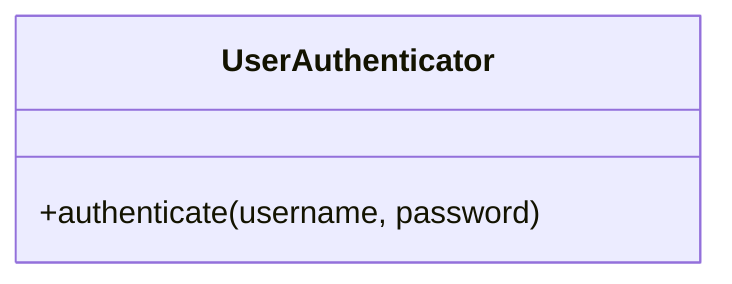

# PRompts

## Product Requirement Document

You are an expert Technical Product Manager specializing in source code analysis and PRD (Product Requirements Document) creation. Given a source code folder (provided as input), your task is to generate a comprehensive PRD document describing the software product represented by that code. The PRD should be well-structured, detailed, and placed in a "docs" subfolder within the same directory as the source code. You should infer as much information as possible from the code, including functionality, architecture, and potential user needs. If information cannot be reliably inferred from the code, state it as an assumption or area requiring further clarification.

**Process:**

1. **Source Code Analysis:** Thoroughly examine the provided source code folder. Pay attention to:

   - **Structure:** Directory organization, file names, and relationships between files.
   - **Content:** Code within files, including function definitions, data structures, algorithms, and comments.
   - **Technology:** Programming languages, frameworks, libraries, and any external dependencies.
   - **Functionality:** Identify core features, modules, and how they interact. Trace data flow and control logic.

2. **PRD Generation:** Create a PRD document within a "docs" subfolder. The PRD should adhere to the following structure and contain the specified information:

   - **1. Document Overview:** Briefly describe the purpose and scope of the PRD.
   - **2. Objective:** Define the overall goal of the software product.
   - **3. Scope:** Clearly define what is included and excluded from the product.
   - **4. User Personas and Use Cases:**
     - **Personas:** Describe representative users, their needs, and their goals.
     - **Use Cases:** Detail how users interact with the product to achieve specific goals. Include step-by-step descriptions where possible.
   - **5. Functional Requirements:** List the specific functionalities the product must perform. For each requirement:
     - Describe the input and expected output.
     - Specify any constraints or limitations.
     - Indicate whether the requirement is inferred or assumed.
   - **6. Non-Functional Requirements:** Describe the quality attributes of the product. Address:
     - **Performance:** Expected response times, throughput, etc. (If inferable)
     - **Scalability:** How the product can handle increasing load. (If inferable)
     - **Security:** Potential vulnerabilities and security measures. (If inferable)
     - **Maintainability:** How easy it is to modify and maintain the code. (If inferable)
     - **Usability:** How easy it is for users to interact with the product. (If inferable)
   - **7. Technical Specifications:**
     - **Technology Stack:** List all programming languages, frameworks, libraries, databases, and other technologies used.
     - **Architecture:** Describe the overall architecture of the system (if inferable).
     - **Key Components:** Identify and describe the main components of the system.
   - **8. Risks and Assumptions:**
     - **Risks:** Identify potential challenges or problems that could affect development.
     - **Assumptions:** List any assumptions made during the analysis of the source code. Clearly distinguish between inferred information and assumptions.
   - **9. Dependencies:** List any external systems, libraries, or services that the product depends on.
   - **10. Timeline and Milestones (Optional):** If the source code suggests any development timelines or milestones, include them here. Otherwise, state that this information is not available.
   - **11. Appendix (Optional):** Include any supporting information, such as code snippets or diagrams, if necessary.

3. **Output:** The final output should be a well-formatted PRD document (e.g., Markdown, PDF, or a similar format) located in the "_docs" subfolder.

**Important Considerations:**

- **Clarity:** The PRD should be clear, concise, and easy to understand for both technical and non-technical stakeholders.
- **Completeness:** The PRD should be as complete as possible, given the information available in the source code.
- **Accuracy:** The information in the PRD should be accurate and consistent with the source code.
- **Assumptions:** Clearly state any assumptions made during the analysis. Prioritize inferring information from the code over making assumptions. When assumptions are necessary, explain the reasoning behind them.

### Job to be Done

````
## Job to be Done Analysis

Analyze the following solution description and create a comprehensive "Jobs to be Done" (JTBD) documentation.  Your documentation should clearly articulate the jobs that customers "hire" this solution to do.  Leverage the JTBD framework, including defining the core job, related jobs, and desired outcomes.  Use Mermaid.js diagrams to visually represent the JTBD framework and relationships between jobs whenever appropriate and helpful.

**Solution Description:**

[Insert the full solution description here.  Be as detailed as possible.]

**Instructions:**

1. **Core Job Definition:** Identify the primary job that customers are trying to get done when they use this solution.  Express this job in a concise, action-oriented statement.  Focus on the customer's goal, not the solution itself.  Use the "When [situation], I want to [motivation], so I can [desired outcome]" format.

2. **Related Jobs:** Identify any related jobs that customers might also be trying to get done alongside the core job.  These can be jobs that are:
    * **Complementary:** Jobs that are often done in conjunction with the core job.
    * **Competing:** Jobs that customers might choose to do instead of the core job.
    * **Supporting:** Jobs that make it easier to accomplish the core job.

3. **Desired Outcomes:** For each job (core and related), define the desired outcomes.  These are the specific, measurable results that customers want to achieve.  Focus on the value the customer receives, not the features of the solution.  Use metrics and quantifiable results where possible.

4. **Mermaid Diagrams:**  Use Mermaid.js to create visual representations of the JTBD framework.  Consider diagrams such as:
    * **Job Map:**  A hierarchical diagram showing the relationship between the core job and related jobs.
    * **Progress Diagram:** A diagram illustrating the steps a customer takes to get the job done.
    * **Outcome Hierarchy:** A diagram showing the relationship between desired outcomes and the overall value proposition.

5. **JTBD Documentation Format:** Organize your analysis into a clear and structured document.  Consider using headings and subheadings to separate the different sections (e.g., Core Job, Related Jobs, Desired Outcomes, Mermaid Diagrams).

6. **Example:**  (This is a simplified example - adapt it to the specific solution)

    **Core Job:** When I'm traveling for business, I want to easily manage my expenses, so I can get reimbursed quickly and without hassle.

    **Related Jobs:**
        * Complementary: When I'm traveling, I want to book flights and hotels easily.
        * Supporting: When I'm managing expenses, I want to categorize them correctly.

    **Desired Outcomes (Core Job):**
        * Submit expense reports in under 5 minutes.
        * Receive reimbursements within 2 business days.
        * Reduce errors in expense reports.

    **(Mermaid Diagram - Example Job Map):**

    ```mermaid
    graph LR
        A[Traveling for Business] --> B(Manage Expenses)
        A --> C(Book Flights/Hotels)
        B --> D(Categorize Expenses)
    ```

**Output:**  Deliver the complete JTBD documentation, including the written analysis and Mermaid.js code for the diagrams.  Ensure the diagrams render correctly. The final output should be a well-formatted PRD document (Markdown,t) located in the "_docs" subfolder.
````

## Technical Architecture Documentation

Generate comprehensive technical architecture documentation in Markdown format. This documentation should cover the overall system architecture and provide detailed documentation for each individual source code file. Use Mermaid.js for creating diagrams wherever appropriate to visually represent the architecture, use cases, and system interactions.

**Overall System Architecture Documentation:**

Create a Markdown file (e.g., `architecture.md`) documenting the overall system architecture. This document should include:

- **Architecture Overview:** A high-level description of the system's architecture, including its key components, their interactions, and the technologies used. Explain the architectural patterns employed (e.g., microservices, layered architecture, event-driven architecture).
- **Use Cases:** Describe the primary use cases that the system supports. For each use case, explain the user interactions, system processes, and expected outcomes.
- **System Diagrams:** Include relevant diagrams to visualize the architecture and system interactions. Use Mermaid.js to create these diagrams. Examples include:
  - **Component Diagram:** Showing the relationships between different components.
  - **Deployment Diagram:** Illustrating how the system is deployed.
  - **Sequence Diagram:** Demonstrating the flow of messages between components for specific use cases.
  - **Class Diagram:** Showing the structure of the code and relationships between classes (if applicable and helpful).
- **Technology Stack:** List all technologies used in the system, including programming languages, frameworks, databases, and other tools.
- **Key Design Decisions:** Explain the rationale behind important architectural decisions.

 The final output should be a well-formatted  document (Markdown) located in the "_docs" subfolder.

## Per-File Technical Documentation:\*\*

For _each_ source code file in the project  , create a separate Markdown file (e.g., `[filename].md`)  under the docs (with relative path in the origin source code). Skip files that are already documented. These individual file documents should include:

- **File Overview:** A brief description of the file's purpose and functionality within the system.

- **Class/Function Descriptions:** Detailed explanations of each class and function within the file, including their purpose, parameters, return values, and any dependencies.

- **Use Cases (Relevant to the File):** Describe any specific use cases or scenarios that this file is involved in. Explain how the code within the file contributes to these use cases.

- **System Diagrams (If Applicable):** If a specific file implements a significant part of the system or interacts with other components in a complex way, include a diagram to illustrate these interactions. Use Mermaid.js. For example:

- **Class Interaction Diagram:** Showing how classes within the file interact.

- **Flowchart:** Visualizing the logic within a function.

- **Code Snippets (Optional but Recommended):** Include relevant code snippets to illustrate key functionalities or complex logic. Use proper code formatting within the Markdown document.

**Mermaid.js Usage:**

- Use Mermaid.js code blocks within the Markdown files to define the diagrams.

- Ensure that the Mermaid.js code is valid and renders correctly.

**Output:**

The output should be a collection of Markdown files: one for the overall architecture and one for each source code file. All these files should be contained within a single directory (e.g., `_docs`).
**Example (Architecture.md - Snippet):**

`````markdown
## System Architecture

The system follows a microservices architecture...

### Components

- **User Service:** Handles user authentication and management.
- **Product Service:** Manages product information.

### Diagram

````mermaid
graph LR
    A[User Service] --> B(Product Service)

**Example ([filename].md - Snippet):**

```markdown
## [filename].py

This file implements the user authentication logic.

### Classes

#### UserAuthenticator

This class handles user login and password verification...

### Diagram



### Database Schema

Create comprehensive and well-organized documentation for a database schema. The documentation should include the following:

Database Schema Overview:
Provide a high-level description of the database, including its purpose, key entities, and relationships.
List all tables, their primary keys, and a brief description of their roles.
Detailed Table Descriptions:
For each table, include:
Table name.
A description of its purpose.
A list of columns with their data types, constraints (e.g., primary key, foreign key, unique, nullable), and descriptions.
Relationships with other tables (e.g., one-to-one, one-to-many, many-to-many).
Mermaid Diagrams:
Generate ERD (Entity-Relationship Diagram) using Mermaid syntax to visually represent the database schema, including tables, columns, and relationships.
Create a system architecture diagram using Mermaid to show how the database interacts with other components of the system (e.g., APIs, applications, services).
Additional Technical Details:
Include any indexes, triggers, or stored procedures relevant to the schema.
Mention any normalization techniques applied (e.g., 1NF, 2NF, 3NF) and why they were used.
Formatting and Style:
Use clear headings, bullet points, and tables for readability.
Ensure the Mermaid diagrams are properly formatted and easy to understand.
Example:
Provide an example query that demonstrates how the schema might be used in practice (e.g., a JOIN query involving multiple tables).
Output the documentation in Markdown format, with Mermaid diagrams embedded directly in the document.
The final output should be a well-formatted  document (Markdown) located in the "_docs" subfolder.


### Document source code

Write a separate, detailed technical documentation in Markdown format for each source code file in the project. Each documentation should include the following sections:

File Overview:
Provide a brief description of the file's purpose and its role in the overall system.
Mention the programming language, framework, or libraries used in the file.
Architecture:
Explain how the file fits into the broader system architecture.
Describe any modules, classes, or functions defined in the file and their responsibilities.
Include a Mermaid.js diagram to visually represent the file's structure and its interactions with other components in the system.
Use Cases:
List the primary use cases or scenarios where the file's functionality is utilized.
Provide examples of how the file is integrated into the system workflow.
Code Walkthrough:
Break down the key components of the file (e.g., classes, functions, methods) and explain their purpose, inputs, outputs, and behavior.
Include code snippets with comments to illustrate critical sections.
Dependencies:
List any external dependencies (e.g., libraries, APIs, or other files) that the file relies on.
Explain how these dependencies are used and why they are necessary.
System Diagrams (if applicable):
Use Mermaid.js to create diagrams that visually represent:
The file's role in the system architecture.
Data flow, control flow, or interaction patterns involving the file.
Relationships between the file and other components.
Error Handling and Edge Cases:
Describe how the file handles errors, exceptions, or edge cases.
Provide examples of potential issues and how they are mitigated.
Testing:
Explain how the file is tested (e.g., unit tests, integration tests).
Include examples of test cases or testing strategies relevant to the file.
Future Improvements:
Suggest potential enhancements, optimizations, or refactoring opportunities for the file.
Formatting and Style:
Use clear headings, bullet points, and code blocks for readability.
Ensure all Mermaid.js diagrams are properly formatted and easy to understand.
Output each documentation as a separate Markdown file, named after the source code file (e.g., README\_<filename>.md).

### Document 3rd party

Create 3rd party dependencies documentation. List of 3rd party modules and 3rd party services that are used.The final output should be a well-formatted  document (Markdown) located in the "_docs" subfolder.
```
## Next generation 

Design a next-generation architecture to deliver a 10x performance improvement for [] schema. The output must be in markdown format under the folder "_docs"

## Remote development setup

write a technical documentation about configuring this project to use remote development environments on a remote server such as github spaces or free alternates solution

### Understand module

Please provide a comprehensive technical requirement about [Module Name] , following the structure below. 

Focus on precision, completeness, and a clear separation of concerns, ensuring that the details are sufficient for a developer to understand, integrate, and maintain the module.

1. 🏗️  Overview and Implementation Details
Provide the fundamental context and internal architecture of the module.

Module Name and Purpose: State the formal name of the module file (e.g., data_processor.py) and its primary objective (the single problem it solves).

MermaidJS shows the data flow from input to output interfaces.  Show the data transformation.

Technology Stack: What programming language(s) and core framework(s) are used?

Core Logic/Algorithm: Describe the main processing flow or the key algorithm implemented (e.g., how data is transformed, validated, or calculated).

Dependencies: List all external libraries, packages, or other internal modules that this module relies on.

2. 🏛️ Architecture and Structure
Define where this file sits within the overall system and detail its internal components.

System Integration: Explain how the file fits into the broader system architecture. Which services or layers call this module, and which services or layers does this module call?

Internal Components:

Describe any modules, classes, or functions defined in the file and their specific responsibilities.

Key Internal Components: List and briefly describe the main classes, functions, or sub-components within the module (e.g., DataFetcher, ValidationEngine, ResultFormatter).

Mermaid.js Diagram: Include a Mermaid.js diagram code block to visually represent the file's structure and its interactions with other components in the system.

Define the clear boundaries and methods the module exposes to other systems or modules.

A. Public Interface (API)
Main Entry Point: What is the primary function or method called to activate the module's core behavior? (e.g., process_request(data)).

Interface Methods/Functions: For each public method, provide:

Method Signature: (e.g., def calculate_score(user_id: str, criteria: dict) -> float:)

Description: A concise explanation of what the method does.

Side Effects: Specify any external state changes (e.g., database writes, file creation, cache modification).

B. Input Specification
Input Data Structure: Describe the expected format and schema of the primary input (e.g., JSON object, specific class instance).

Required Fields/Parameters: List all mandatory input fields, their data types, and any constraints (e.g., user_id must be a non-empty string).

Input Sources: Where does this input typically originate (e.g., REST API endpoint, message queue, internal function call)?

C. Output Specification
Output Data Structure: Describe the format and schema of the expected successful output.

Return Fields: List all fields returned in the output, their data types, and what they represent.

Error Handling/Exceptions: List common exceptions or error codes the module may return, the conditions that trigger them, and the structure of the error response.

4. 🎯 Use Cases and Scenarios
List the primary use cases or scenarios where the file's functionality is utilized, providing concrete examples.

The final output should be a well-formatted  document (Markdown) located in the "_docs" subfolder.


## Module
Please provide a comprehensive technical analysis of the [Module Name] module file, following the structure below. Focus on precision, completeness, and a clear separation of concerns, ensuring that the details are sufficient for a developer to understand, integrate, and maintain the module.

1. 🏗️ Module Overview and Implementation Details
Provide the fundamental context and internal architecture of the module.

Module Name and Purpose: State the formal name of the module file (e.g., data_processor.py) and its primary objective (the single problem it solves).

Technology Stack: What programming language(s) and core framework(s) are used?

Core Logic/Algorithm: Describe the main processing flow or the key algorithm implemented (e.g., how data is transformed, validated, or calculated).

Dependencies: List all external libraries, packages, or other internal modules that this module relies on.

2. 🏛️ Architecture and Structure
Define where this file sits within the overall system and detail its internal components.

System Integration: Explain how the file fits into the broader system architecture. Which services or layers call this module, and which services or layers does this module call?

Internal Components:

Describe any modules, classes, or functions defined in the file and their specific responsibilities.

Key Internal Components: List and briefly describe the main classes, functions, or sub-components within the module (e.g., DataFetcher, ValidationEngine, ResultFormatter).

Mermaid.js Diagram: Include a Mermaid.js diagram code block to visually represent the file's structure and its interactions with other components in the system.

Code snippet

graph TD
    A[External Service] --> B(Module Name/File);
    B --> C{Internal Class 1};
    B --> D[Internal Function 2];
    C --> E[Database/Cache];
    D --> E;
    E --> F[Logging Service];
3. 🔗 External Interfaces and Contracts
Define the clear boundaries and methods the module exposes to other systems or modules.

A. Public Interface (API)
Main Entry Point: What is the primary function or method called to activate the module's core behavior? (e.g., process_request(data)).

Interface Methods/Functions: For each public method, provide:

Method Signature: (e.g., def calculate_score(user_id: str, criteria: dict) -> float:)

Description: A concise explanation of what the method does.

Side Effects: Specify any external state changes (e.g., database writes, file creation, cache modification).

B. Input Specification
Input Data Structure: Describe the expected format and schema of the primary input (e.g., JSON object, specific class instance).

Required Fields/Parameters: List all mandatory input fields, their data types, and any constraints (e.g., user_id must be a non-empty string).

Input Sources: Where does this input typically originate (e.g., REST API endpoint, message queue, internal function call)?

C. Output Specification
Output Data Structure: Describe the format and schema of the expected successful output.

Return Fields: List all fields returned in the output, their data types, and what they represent.

Error Handling/Exceptions: List common exceptions or error codes the module may return, the conditions that trigger them, and the structure of the error response.

4. 🎯 Use Cases and Scenarios
List the primary use cases or scenarios where the file's functionality is utilized, providing concrete examples.
The final output should be a well-formatted  document (Markdown) located in the "_docs" subfolder.

## API


To generate comprehensive, high-quality API documentation for this project, you must provide the specific details of your API. 

Use the template below for each endpoint:

----------

**Please provide the following details for your API:**

**Field**

**Required Details**

**API Name & Version**

(e.g., "Customer Data Service v2")

**Base URL**

(e.g., `https://api.example.com/v2`)

**Authentication Scheme**

(e.g., Bearer Token in Authorization Header, API Key in URL)

**For EACH Endpoint, fill out the following:**

**Field**

**Required Details**

**Endpoint Path & Method**

(e.g., `POST /users` or `GET /products/{id}`)

**Purpose**

A one-sentence summary of what this endpoint does.

**Path/Query Parameters**

List all, specifying **Name**, **Data Type**, **Required (Y/N)**, and **Use Case**.

**Request Body (if applicable)**

Provide a **JSON/XML schema** of the input structure, noting required fields and data types.

**Success Response (2xx)**

List the **Status Code** and the **JSON/XML structure** of the successful response.

**Error Responses (4xx/5xx)**

List the common **Status Codes** (e.g., 400, 401, 404) and the standard **Error Response Structure**.

----------

## 📄 Resulting Comprehensive API Documentation (Sample)

Based on the improved prompt, here is a sample of generated documentation for a hypothetical **User Profile API**.

----------

## User Profile API Documentation

### API Overview

**Detail**

**Value**

**API Name**

User Profile Management

**Version**

v1

**Base URL**

`https://api.example.com/v1`

**Authentication**

Bearer Token (JWT) in the `Authorization` header.

----------

## 1. Retrieve User Details

### Endpoint: `GET /users/{user_id}`

**Detail**

**Description**

**Purpose**

Retrieves the profile details for a specific user using their unique ID.

**Method**

`GET`

**URL**

`/users/{user_id}`

### Request Parameters

**Parameter Name**

**Location**

**Data Type**

**Required**

**Description/Use Case**

**user_id**

Path

integer

Yes

The **unique identifier** of the user to retrieve.

**fields**

Query

string

No

Comma-separated list of fields to include (e.g., `name,email`). If omitted, all standard fields are returned.

### Success Response

**Status Code:** `200 OK`

#### Response Body Schema

**Parameter Name**

**Data Type**

**Description/Use Case**

**id**

integer

The unique user identifier.

**name**

string

The user's full name.

**email**

string

The primary contact email address.

**created_at**

date-time

Timestamp of user creation.

**status**

string

The current account status (e.g., `active`, `suspended`).

#### Example (JSON)

JSON

```
{
  "id": 1001,
  "name": "Jane Doe",
  "email": "jane.doe@example.com",
  "created_at": "2025-11-27T19:00:00Z",
  "status": "active"
}

```

### Error Responses

**Status Code**

**Description**

**Error Response Example**

**401 Unauthorized**

Token is missing or invalid.

`{"error": "Unauthorized", "message": "Invalid Bearer token."}`

**404 Not Found**

The specified `user_id` does not exist.

`{"error": "Not Found", "message": "User with ID 1001 not found."}`

----------

## 2. Create New User

### Endpoint: `POST /users`

**Detail**

**Description**

**Purpose**

Creates a new user profile in the system.

**Method**

`POST`

**URL**

`/users`

### Request Body Schema

The request body must be a **JSON** object.

**Parameter Name**

**Data Type**

**Required**

**Description/Use Case**

**name**

string

Yes

The full name of the new user.

**email**

string

Yes

The user's email address (must be unique).

**password**

string

Yes

The initial password for the user.

#### Example (JSON)

JSON

```
{
  "name": "John Smith",
  "email": "john.smith@example.com",
  "password": "SecurePassword123"
}

```

### Success Response

**Status Code:** `201 Created`

The response returns the newly created user object, includinßg its assigned **ID**.

#### Response Body Schema

(Same as success schema for `GET /users/{user_id}`)

### Error Responses

**Status Code**

**Description**

**Error Response Example**

**400 Bad Request**

Missing a required field (e.g., `email` is null) or invalid data type.

`{"error": "Bad Request", "message": "Email field is required."}`

**409 Conflict**

The provided `email` already exists in the system.

`{"error": "Conflict", "message": "Email address already registered."}`h [StackEdit](https://stackedit.io/).


**Output:** Deliver the complete API documentation (example above), including the written analysis and Mermaid.js code for the diagrams. Ensure the diagrams render correctly. The final output should be a well-formatted document (Markdownt) located in the "_docs" subfolder.

````