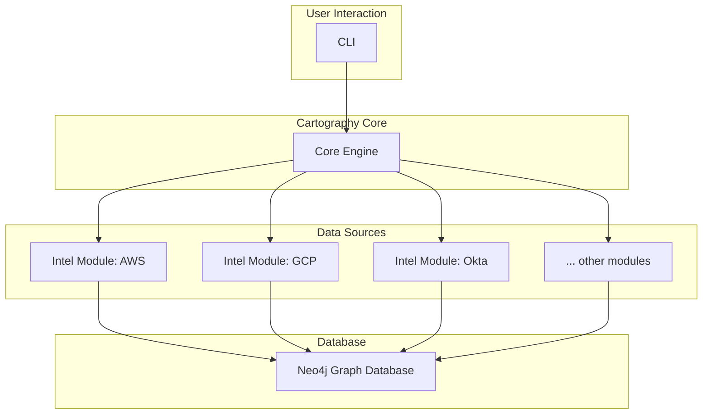
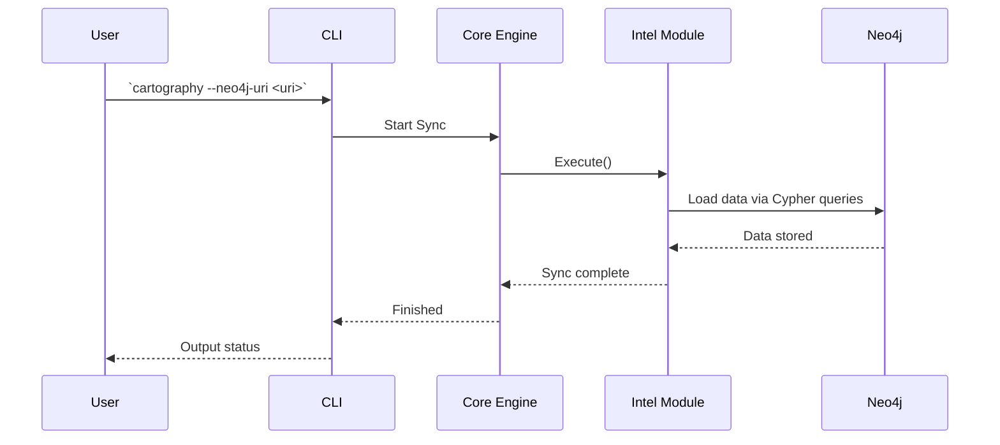
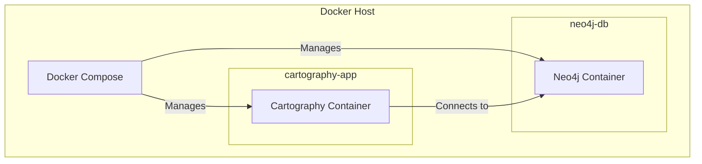

# Cartography Technical Architecture

## 1. Architecture Overview

Cartography is a powerful tool designed to consolidate infrastructure assets and their relationships from multiple sources into a unified graph database, powered by Neo4j. This provides a centralized and queryable view of your entire technical ecosystem, enabling security analysis, infrastructure discovery, and compliance auditing.

The architecture of Cartography is designed to be modular and extensible, following a **plugin-based pattern**. This allows for the easy addition of new data sources (referred to as "intel modules") without modifying the core engine.

### Key Components

- **Core Engine:** The central orchestrator of the system. It manages the synchronization process, loading and executing the various intel modules, and handling the connection to the Neo4j database.
- **Intel Modules:** These are the plugins responsible for connecting to specific data sources (e.g., AWS, GCP, Azure, Okta, Kubernetes), fetching asset data, and formatting it for ingestion into the graph.
- **Graph Database (Neo4j):** The heart of Cartography. It stores all the asset information as nodes and their relationships as edges, creating a rich and interconnected graph of your infrastructure.
- **Command-Line Interface (CLI):** The primary interface for interacting with Cartography. It allows users to initiate sync jobs, run analysis queries, and manage the system.

### Component Interaction Diagram

## 2. Use Cases

Cartography is hired to do several "jobs" for its users. Here are some of the primary use cases:

### a. Security and Risk Assessment

- **Objective:** To identify and prioritize security risks within the infrastructure.
- **Process:**
  1. A security engineer runs a sync job to get the latest infrastructure data.
  2. They run pre-defined or custom analysis queries to find vulnerabilities, such as:
      - Publicly exposed EC2 instances.
      - Overly permissive IAM roles.
      - S3 buckets with insecure configurations.
  3. The results are used to prioritize remediation efforts.

### b. Infrastructure Discovery and Dependency Mapping

- **Objective:** To gain a comprehensive understanding of all assets and their dependencies.
- **Process:**
  1. A DevOps or Cloud Engineer runs a sync to update the graph.
  2. They query the graph to understand the "blast radius" of a potential change or to troubleshoot an issue by tracing dependencies.
  - **Example Query:** `MATCH (i:AWSRole)--(c:AWSAccount) RETURN *`

### c. Drift Detection

- **Objective:** To automatically detect deviations from a desired infrastructure state.
- **Process:**
  1. An engineer defines the desired state in a "shortcut" file.
  2. The `driftdetect` module is run as part of the sync.
  3. Any deviations are reported, allowing for quick remediation.

### Sync Process Sequence Diagram

This diagram shows the sequence of events during a typical data sync operation.

## 3. Deployment

Cartography is typically deployed using Docker and Docker Compose, which simplifies the setup of both the Cartography application and the Neo4j database.

### Deployment Diagram

## 4. Technology Stack

- **Programming Language:** Python 3.10
- **Database:** Neo4j (using the Cypher query language)
- **Key Libraries & Frameworks:**
  - `boto3`: For AWS integration.
  - `google-api-python-client`: For GCP integration.
  - `azure-identity` & `azure-mgmt-resource`: For Azure integration.
  - `oci`: For Oracle Cloud Infrastructure.
  - `okta`: For Okta integration.
  - `kubernetes`: For Kubernetes integration.
  - `neo4j`: The official Python driver for Neo4j.
  - `marshmallow`: For object serialization/deserialization.
- **Containerization:** Docker

## 5. Key Design Decisions

- **Graph Database as the Foundation:** The choice of Neo4j is central to Cartography's design. A graph database is uniquely suited to model and query the complex and often recursive relationships found in modern infrastructure. This allows for powerful and intuitive querying of asset dependencies and attack paths.

- **Extensible Plugin Architecture:** The decision to build Cartography with a plugin-based architecture (the `intel` modules) was crucial for its long-term viability and community adoption. It allows the tool to evolve and support new technologies without requiring changes to the core engine. This is highlighted by the "Plugin development" focus of many maintainers.

- **CLI-First Approach:** The focus on a robust command-line interface makes Cartography ideal for automation, integration into CI/CD pipelines, and for the target audience of engineers who are comfortable in the terminal.

- **Analysis Jobs as First-Class Citizens:** Cartography doesn't just ingest data; it provides value-added analysis on top of it. The concept of "analysis jobs" (pre-written Cypher queries) allows users to quickly identify common security risks and misconfigurations without needing to become expert Cypher developers themselves.
