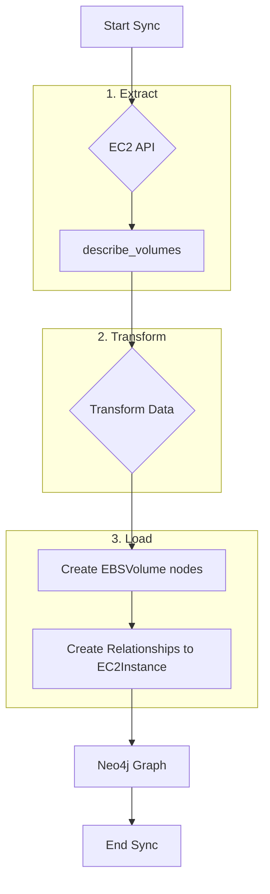
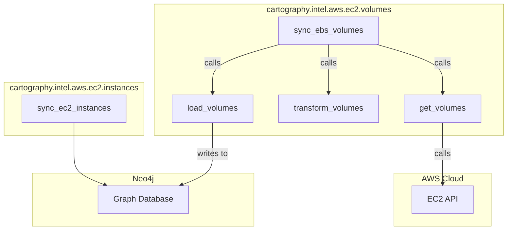

# Technical Requirements: AWS EC2 EBS Volumes Intelligence Module

This document provides a comprehensive technical breakdown of the AWS EC2 EBS Volumes intelligence module within Cartography. It is intended for developers who need to understand, integrate, and maintain this module.

## 🏗️ Overview and Implementation Details

### Module Name and Purpose

*   **Module Name:** `cartography.intel.aws.ec2.volumes.py`
*   **Purpose:** The primary objective of this module is to discover and sync Elastic Block Store (EBS) volumes within an AWS account. It gathers detailed information about each volume, including its size, state, encryption status, and any attachments to EC2 instances.

### Data Flow

The module extracts EBS volume data from AWS, transforms it for graph ingestion, and loads it into Neo4j, creating nodes and relationships.



### Technology Stack

*   **Programming Language:** Python
*   **Core Libraries:**
    *   `boto3`: The AWS SDK for Python, used to interact with the EC2 API.
    *   `neo4j`: The official Python driver for Neo4j.

### Core Logic/Algorithm

1.  **Iterate Regions:** The sync process is wrapped in the `@aws_handle_regions` decorator, so it executes for each configured AWS region.
2.  **Fetch Volumes:** In each region, the `get_volumes` function uses a paginator for the `ec2:DescribeVolumes` API call to retrieve a complete list of all EBS volumes.
3.  **Transform Data:** The `transform_volumes` function processes this list. A crucial step here is handling attachments. If a volume is attached to an EC2 instance, the function creates a distinct data record for that attachment, including the `InstanceId`. If a volume is unattached, a single record is created for it. This ensures that the relationship to the instance is captured.
4.  **Load Data:** The `load_volumes` function uses Cartography's generic `load()` transaction helper. It passes the transformed data and the `EBSVolumeSchema` model. This model defines the Cypher query that `MERGE`s `EBSVolume` nodes and, if an `InstanceId` is present in the data, `MERGE`s the relationship to the corresponding `EC2Instance` node.
5.  **Cleanup:** After all regions are synced, a graph cleanup job is run. It uses the `EBSVolumeSchema` to identify and remove any `EBSVolume` nodes (and their relationships) that were not updated in the current sync run, ensuring that deleted or detached volumes are removed from the graph.

### Dependencies

*   **External:** `boto3`, `neo4j-driver`
*   **Internal (Cartography):**
    *   `cartography.client.core.tx.load`: A generic function for loading data based on a schema.
    *   `cartography.graph.job.GraphJob`: Used for running the cleanup job.
    *   `cartography.intel.aws.util.arns`: For building the ARN for each volume.
    *   `cartography.models.aws.ec2.volumes.EBSVolumeSchema`: The data model defining the node label, properties, and relationships for EBS volumes.
    *   `cartography.util.aws_handle_regions`: A decorator to handle region iteration.

---

## 🏛️ Architecture and Structure

### System Integration

This module is part of the broader EC2 intelligence sync. It runs after the `cartography.intel.aws.ec2.instances` module has synced EC2 instances. This order is important because the `load_volumes` function expects that `EC2Instance` nodes may already exist in the graph to link to.

### Internal Components

*   **Main Entry Point:**
    *   `sync_ebs_volumes()`: Orchestrates the entire sync process for all specified regions.
*   **Data Fetching:**
    *   `get_volumes()`: Makes the `describe_volumes` API call for a given region.
*   **Data Transformation:**
    *   `transform_volumes()`: Processes the raw API response and prepares it for loading, handling the logic for attachments.
*   **Data Loading:**
    *   `load_volumes()`: Executes the Neo4j transaction to write the data to the graph.
*   **Cleanup:**
    *   `cleanup_volumes()`: Runs the graph cleanup job to remove stale data.

### Mermaid.js Diagram: Component Interactions



The diagram shows that the `instances` sync runs first, populating the graph. Then, the `volumes` sync fetches data from the EC2 API, transforms it, and loads it into the graph, potentially creating links to the pre-existing `EC2Instance` nodes.

---

## 🔗 External Interfaces and Contracts

### A. Public Interface (API)

*   **Main Entry Point:** `sync_ebs_volumes(neo4j_session: neo4j.Session, boto3_session: boto3.session.Session, regions: List[str], current_aws_account_id: str, update_tag: int, common_job_parameters: Dict[str, Any])`
*   **Description:** This function orchestrates the complete discovery and synchronization of EBS volumes for a given AWS account across multiple regions.
*   **Side Effects:**
    *   Writes `EBSVolume` nodes to the Neo4j database.
    *   Creates `ATTACHED_TO` relationships between `EBSVolume` and `EC2Instance` nodes.
    *   Runs a cleanup job, which may delete stale volume-related nodes and relationships.

### B. Input Specification

*   **`neo4j_session`**: An active `neo4j.Session` object. (Required)
*   **`boto3_session`**: An active `boto3.session.Session` object with credentials for the target AWS account. (Required)
*   **`regions`**: A `List[str]` of AWS regions to scan. (Required)
*   **`current_aws_account_id`**: The 12-digit ID of the AWS account being scanned. (Required)
*   **`update_tag`**: An `int` timestamp used to version the data from the current sync run. (Required)
*   **`common_job_parameters`**: A `Dict` containing metadata for the cleanup job. (Required)
*   **Input Sources:** This function is typically invoked by the main AWS sync orchestrator within Cartography.

### C. Output Specification

*   **Output Data Structure:** The function returns `None`. Its output is the state change in the Neo4j database.
*   **Error Handling:**
    *   The `get_volumes` function is decorated with `@aws_handle_regions`, which includes error handling for common `boto3` client errors (like `AccessDeniedException`), logging the error and skipping the region rather than crashing.

---

## 🎯 Use Cases and Scenarios

*   **Use Case 1: Identify Unencrypted Volumes**
    *   **Scenario:** A security engineer needs to find all EBS volumes that are not encrypted, as this violates a compliance policy.
    *   **Integration:** The engineer can run a simple Cypher query on the graph populated by this module:
        ```cypher
        MATCH (v:EBSVolume) WHERE v.encrypted = false
        RETURN v.arn, v.region
        ```

*   **Use Case 2: Find Unattached (Orphaned) Volumes**
    *   **Scenario:** A cloud cost manager wants to identify and delete unattached EBS volumes, which incur costs but provide no value.
    *   **Integration:** The graph model makes this easy. Unattached volumes are those that lack an outgoing `ATTACHED_TO` relationship.
        ```cypher
        MATCH (v:EBSVolume)
        WHERE NOT (v)-[:ATTACHED_TO]->(:EC2Instance)
        RETURN v.arn, v.size, v.region
        ```

*   **Use Case 3: Map Instance-to-Storage Relationships**
    *   **Scenario:** A system administrator is planning to decommission an EC2 instance and needs to know which EBS volumes are attached to it to ensure proper data backup.
    *   **Integration:** A query can show all volumes attached to a specific instance:
        ```cypher
        MATCH (i:EC2Instance{instanceid: 'i-1234567890abcdef0'})<-[:ATTACHED_TO]-(v:EBSVolume)
        RETURN v.arn, v.size, v.VolumeType
        ```
