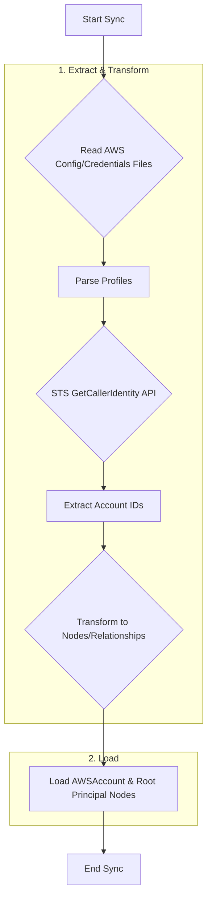
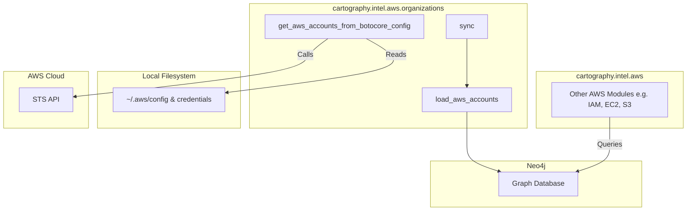

# Technical Requirements: AWS Organizations Intelligence Module

This document provides a comprehensive technical breakdown of the AWS Organizations intelligence module within Cartography. It is intended for developers who need to understand, integrate, and maintain this foundational piece of the AWS sync.

## 🏗️ Overview and Implementation Details

### Module Name and Purpose

*   **Module Name:** `cartography.intel.aws.organizations.py`
*   **Purpose:** The primary objective of this module is to discover and model the AWS accounts that Cartography will scan. It reads AWS configuration files (e.g., `~/.aws/config`, `~/.aws/credentials`) to identify available profiles, determines the AWS Account ID for each profile, and loads them into a Neo4j graph.

### Data Flow

The module extracts AWS account information from local configuration files and models them as the root nodes for an AWS asset inventory.



### Technology Stack

*   **Programming Language:** Python
*   **Core Libraries:**
    *   `boto3`: The AWS SDK for Python, used to create sessions and call the STS API.
    *   `botocore`: The underlying library for `boto3`, used for error handling and configuration parsing.
    *   `neo4j`: The official Python driver for Neo4j.

### Core Logic/Algorithm

1.  **Read Configuration:** The module leverages `boto3`'s default session handling to find and parse AWS configuration and credential files.
2.  **Iterate Profiles:** It iterates through all available profiles listed in the config files.
3.  **Get Account ID:** For each profile, it creates a new `boto3.Session` and calls the `sts:GetCallerIdentity` API. This API call returns, among other things, the 12-digit AWS Account ID for the credentials in that profile.
4.  **Handle Errors:** It includes robust error handling to manage scenarios where a profile is misconfigured or lacks the necessary permissions to call `sts:GetCallerIdentity`.
5.  **Load Accounts:** Each successfully identified account is loaded into the Neo4j graph. The `load_aws_accounts` function executes a Cypher query to:
    *   `MERGE` an `AWSAccount` node with its ID.
    *   `MERGE` a corresponding `AWSPrincipal` node representing the account's root user.
    *   Create a `RESOURCE` relationship from the account to its root principal.
    *   Mark the account as `inscope=true` to signify that Cartography is configured to scan it.

### Dependencies

*   **External:** `boto3`, `botocore`, `neo4j-driver`
*   **Internal (Cartography):** This module is largely self-contained but its output is critical for all other AWS modules.

---

## 🏛️ Architecture and Structure

### System Integration

This is the definitive starting point for the entire AWS sync process. It establishes the top-level `AWSAccount` nodes that every other AWS intelligence module will use as a starting point. Other modules query the graph to get the list of in-scope account IDs and then perform their own service-specific syncs within each of those accounts.

### Internal Components

*   **Main Entry Point:**
    *   `sync()`: The orchestrator that calls the account loading function.
*   **Configuration & Data Fetching:**
    *   `get_aws_accounts_from_botocore_config()`: The core function that reads the config, iterates profiles, calls STS, and returns a dictionary mapping profile names to account IDs.
    *   `get_aws_account_default()`: Specifically handles the `default` profile.
    *   `get_caller_identity()`: A helper that makes the `sts:GetCallerIdentity` API call.
*   **Data Loading:**
    *   `load_aws_accounts()`: Takes the account data and executes the Cypher query to load it into Neo4j.

### Mermaid.js Diagram: Component Interactions



The diagram shows that the `organizations` module reads local AWS config files and calls the STS API to get account IDs. This data is loaded into the graph, which is then queried by all other AWS modules to begin their syncs.

---

## 🔗 External Interfaces and Contracts

### A. Public Interface (API)

*   **Main Entry Point:** `sync(neo4j_session: neo4j.Session, accounts: Dict, update_tag: int, common_job_parameters: Dict)`
*   **Description:** This is the primary function for external invocation. It orchestrates the discovery and synchronization of AWS accounts defined in the local configuration.
*   **Side Effects:**
    *   Writes `AWSAccount` and root `AWSPrincipal` nodes to the Neo4j database.
    *   Sets the `inscope` property on `AWSAccount` nodes to `true`.

### B. Input Specification

*   **`neo4j_session`**:
    *   **Structure:** An active `neo4j.Session` object.
    *   **Required:** Yes.
*   **`accounts`**:
    *   **Structure:** A `Dict` where keys are profile names and values are AWS Account IDs, typically generated by `get_aws_accounts_from_botocore_config()`.
    *   **Required:** Yes.
*   **`update_tag`**:
    *   **Structure:** `int` (Timestamp).
    *   **Required:** Yes.
    *   **Constraint:** Used to version the data from the current sync run.
*   **`common_job_parameters`**:
    *   **Structure:** `Dict`.
    *   **Required:** Yes.
    *   **Constraint:** Although passed in, it is not used in this specific module as there is no cleanup job for in-scope accounts.
*   **Input Sources:** The `sync` function is called by the main AWS sync loop in Cartography. The `accounts` dictionary is provided by calling `get_aws_accounts_from_botocore_config()` in the same module.

### C. Output Specification

*   **Output Data Structure:** The function returns `None`. Its output is the state change in the Neo4j database.
*   **Error Handling:**
    *   The `get_*` functions are wrapped in `try...except` blocks to catch `botocore.exceptions.BotoCoreError` and `botocore.exceptions.ClientError`. This handles misconfigured profiles or permission errors gracefully by logging a detailed error and continuing with the next profile, preventing a crash.

---

## 🎯 Use Cases and Scenarios

*   **Use Case 1: Bootstrapping the Entire AWS Sync (Internal)**
    *   **Scenario:** The AWS EC2 module needs to discover all EC2 instances.
    *   **Integration:** Before the EC2 module runs, the organizations module populates the graph with all in-scope AWS accounts. The EC2 module then runs a query like `MATCH (a:AWSAccount{inscope: true}) RETURN a.id` to get the list of account IDs it needs to scan.

*   **Use Case 2: Multi-Account Inventory**
    *   **Scenario:** A cloud security engineer wants a single place to see all the AWS accounts the organization is monitoring with Cartography.
    *   **Integration:** After a sync, the engineer can query the graph for a complete and up-to-date inventory:
        ```cypher
        MATCH (a:AWSAccount{inscope: true})
        RETURN a.name, a.id
        ```
        This provides a simple, consolidated inventory without needing to manually inspect config files or run AWS CLI commands.
