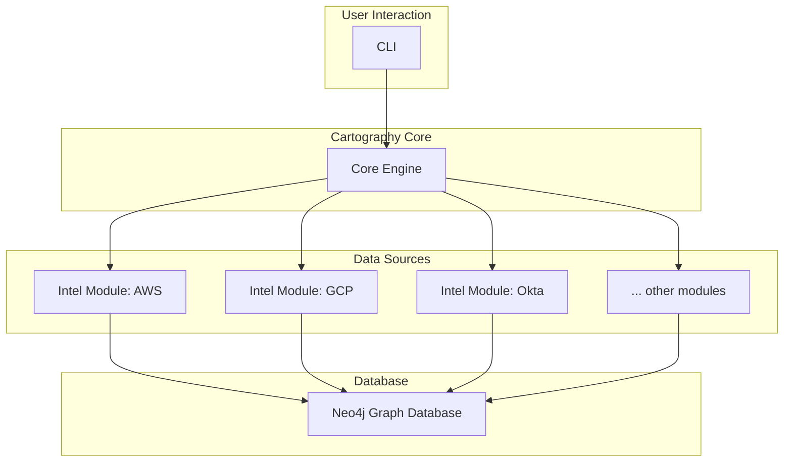

# Cartography Database Schema (Neo4j)

## 1. Database Schema Overview

Cartography utilizes a **Neo4j graph database**, not a traditional relational database. This means that instead of tables, rows, and columns, the data is stored as a network of nodes, relationships, and properties.

- **Purpose:** The database's primary purpose is to model a complete and interconnected map of a technical infrastructure. This graph model allows for powerful and efficient querying of complex relationships, which is ideal for security analysis, dependency tracking, and infrastructure discovery.
- **Key Entities (Nodes):** Entities are represented as nodes with specific labels. A single node can have multiple labels. The primary identifier for most nodes is an `id` property, which is typically an ARN for AWS resources, a resource ID for GCP/Azure, or a unique identifier for other services.
- **Relationships:** The connections between entities are represented as directed relationships, each with a specific type (e.g., `RESOURCE`, `STS_ASSUME_ROLE`).

### System Architecture Interaction

The database is the central repository of Cartography. The Core Engine, driven by the CLI, orchestrates various intel modules that populate and update the graph.



## 2. Graph Schema Diagram (ERD Equivalent)

This diagram represents a small subset of the AWS schema to illustrate the relationships between key entities.

```mermaid
erDiagram
    AWSAccount {
        string id **PK**
        string name
        string arn
    }
    AWSRole {
        string id **PK**
        string arn
    }
    AWSPolicy {
        string id **PK**
        string arn
    }
    EC2Instance {
        string id **PK**
        string publicdnsname
        string privateipaddress
    }
    IAMUser {
        string id **PK**
        string arn
    }

    AWSAccount ||--o{ AWSRole : RESOURCE
    AWSAccount ||--o{ EC2Instance : RESOURCE
    AWSAccount ||--o{ IAMUser : RESOURCE
    AWSRole ||--o{ AWSPolicy : HAS_POLICY
    IAMUser ||--o{ AWSPolicy : HAS_POLICY
    IAMUser }o--o{ AWSRole : STS_ASSUME_ROLE
```

## 3. Detailed Node Label Descriptions

Below are descriptions for a few key AWS node labels. The **bolded** property is indexed for fast lookups.

### `AWSAccount`

- **Description:** Represents an Amazon Web Services account.
- **Properties:**
  - **`id`** (string, **PK**): The AWS Account ID.
  - `arn` (string): The full ARN of the account.
  - `name` (string): The friendly name of the account.
  - `lastupdated` (int): Timestamp of the last update.
- **Relationships:**
  - `(AWSAccount)-[:RESOURCE]->(AWSRole)`: An account contains roles.
  - `(AWSAccount)-[:RESOURCE]->(EC2Instance)`: An account contains EC2 instances.

### `AWSRole`

- **Description:** Represents an AWS IAM Role.
- **Properties:**
  - **`id`** (string, **PK**): The ARN of the role.
  - `name` (string): The name of the role.
  - `path` (string): The path to the role.
- **Relationships:**
  - `(AWSRole)-[:HAS_POLICY]->(AWSPolicy)`: The role is attached to a policy.
  - `(IAMUser)-[:STS_ASSUME_ROLE]->(AWSRole)`: A user can assume this role.

### `EC2Instance`

- **Description:** Represents an AWS EC2 Compute Instance.
- **Properties:**
  - **`id`** (string, **PK**): The instance ID.
  - `publicdnsname` (string): The public DNS name of the instance.
  - `privateipaddress` (string): The private IP address.
  - `instancestate` (string): The current state of the instance (e.g., running, stopped).
- **Relationships:**
  - `(EC2Instance)-[:IS_IN]->(Subnet)`: The instance is located in a subnet.
  - `(EC2Instance)-[:HAS_SECURITY_GROUP]->(SecurityGroup)`: The instance is associated with a security group.

## 4. Additional Technical Details

### Indexes

Cartography creates indexes on the `id` property of most node labels. This is crucial for performance, as it allows for very fast lookups of specific nodes, which is a common operation during the sync process (e.g., "does this node already exist?").

### Normalization

Normalization is a concept from the relational database world aimed at reducing data redundancy. In graph databases, the design philosophy is different. The Cartography schema is intentionally denormalized in some areas to favor query performance.

Instead of using JOINs (which don't exist in graph dbs), Cartography models direct relationships between nodes. This may mean some data is repeated (e.g., an account ID might be present on multiple nodes), but it allows for incredibly fast traversals across the graph, which is the primary strength of this model.

## 5. Example Query

Here is an example of a Cypher query to find all publicly exposed EC2 instances that have port 22 open.

```cypher
// Find all EC2 instances with a public IP
MATCH (instance:EC2Instance)
WHERE exists(instance.publicdnsname)

// Find the security groups attached to these instances
MATCH (instance)-[:HAS_SECURITY_GROUP]->(sg:SecurityGroup)

// Find the inbound rules for these security groups
MATCH (sg)-[:HAS_INBOUND_RULE]->(rule:IpRule)

// Filter for rules that allow access from the internet (0.0.0.0/0) on port 22
WHERE rule.from_port = 22 AND rule.to_port = 22 AND rule.ip_range = '0.0.0.0/0'

// Return the instance details
RETURN instance.id, instance.publicdnsname
```
