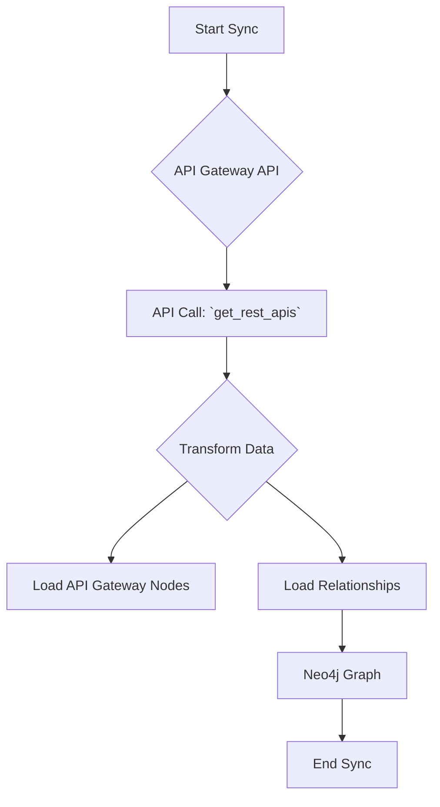

# Technical Requirements: AWS API Gateway Intelligence Module

This document provides a comprehensive technical breakdown of the AWS API Gateway intelligence module within Cartography. It is intended for developers who need to understand, integrate, and maintain this module.

## 🏗️ Overview and Implementation Details

### Module Name and Purpose

*   **Module Name:** `cartography.intel.aws.apigateway.py`
*   **Purpose:** This module discovers API Gateway REST APIs, stages, resources, methods, integrations, and certificates.

### Data Flow

The module queries the API Gateway API, transforms the responses, and loads the data into Neo4j.



---

## ETL Process: End-to-End Data Flow

This section details the full Extract, Transform, and Load process for API Gateway.

### 1. Extract

*   **Source Code:**
    *   **File:** `cartography.intel.aws.apigateway.py`
    *   **Function:** `get_rest_apis()`

*   **Process:**
    This function retrieves all REST APIs in a given region. For each API, it subsequently fetches its stages, resources, methods, and integrations.

*   **Input Data (Sample Raw JSON from `get_rest_apis`):**

    ```json
    {
        "items": [
            {
                "id": "xxxxxxxxxx",
                "name": "MyApi",
                "createdDate": 1609459200,
                "apiKeySource": "HEADER",
                "endpointConfiguration": {
                    "types": [
                        "REGIONAL"
                    ]
                }
            }
        ]
    }
    ```

### 2. Transform

*   **Source Code:**
    *   **File:** `cartography.intel.aws.apigateway.py`
    *   **Function:** `transform_*` functions (e.g., `_transform_methods`, `_transform_integrations`)

*   **Process:**
    The data is transformed within several helper functions. For example, `_transform_methods` processes the methods for each resource and `_transform_integrations` processes the integrations for each method.

*   **Transformed Data Structure (Example for an API):**

    ```python
    [
        {
            "id": "xxxxxxxxxx",
            "name": "MyApi",
            "region": "us-east-1",
            "created_date": 1609459200
        }
    ]
    ```

### 3. Load

*   **Source Code:**
    *   **File:** `cartography.intel.aws.apigateway.py`
    *   **Function:** `load_*` functions (e.g., `_load_apis`, `_load_resources`)

*   **Graph Schema:**
    *   `cartography.models.aws.apigateway.APIGatewayRestAPI`
    *   `cartography.models.aws.apigateway.APIGatewayStage`
    *   `cartography.models.aws.apigateway.APIGatewayResource`
    *   `cartography.models.aws.apigateway.APIGatewayMethod`
    *   `cartography.models.aws.apigateway.APIGatewayIntegration`
    *   `cartography.models.aws.apigatewaycertificate.APIGatewayCertificateSchema`

*   **Process:**
    The `load_*` functions use Cartography's generic `load()` transaction helper to `MERGE` the nodes and relationships into the graph.

*   **Output Queries (Sample Cypher):**

    ```cypher
    // Load the main API Gateway node
    MERGE (n:APIGatewayRestAPI{id: {id}})
    SET n.name = {name},
        n.region = {region},
        n.created_date = {created_date},
        n.lastupdated = {UPDATE_TAG}

    // Load a relationship to a stage
    MATCH (api:APIGatewayRestAPI{id: {api_id}})
    MATCH (stage:APIGatewayStage{id: {stage_id}})
    MERGE (api)-[r:HAS_STAGE]->(stage)
    SET r.lastupdated = {UPDATE_TAG}
    ```
