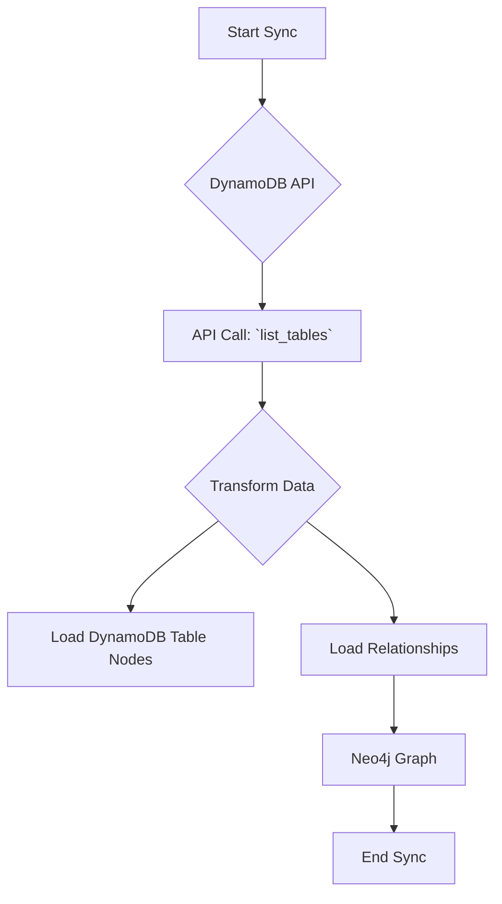

# Technical Requirements: AWS DynamoDB Intelligence Module

This document provides a comprehensive technical breakdown of the AWS DynamoDB intelligence module within Cartography. It is intended for developers who need to understand, integrate, and maintain this module.

## 🏗️ Overview and Implementation Details

### Module Name and Purpose

*   **Module Name:** `cartography.intel.aws.dynamodb.py`
*   **Purpose:** This module discovers DynamoDB tables and their associated Global Secondary Indexes (GSIs).

### Data Flow

The module queries the DynamoDB API, transforms the responses, and loads the data into Neo4j.



---

## ETL Process: End-to-End Data Flow

This section details the full Extract, Transform, and Load process for DynamoDB.

### 1. Extract

*   **Source Code:**
    *   **File:** `cartography.intel.aws.dynamodb.py`
    *   **Function:** `get_dynamodb_tables()`

*   **Process:**
    This function retrieves a list of all DynamoDB table names in a given region. For each table, it then calls `describe_table` to get detailed information.

*   **Input Data (Sample Raw JSON from `describe_table`):**

    ```json
    {
        "Table": {
            "AttributeDefinitions": [
                {
                    "AttributeName": "id",
                    "AttributeType": "S"
                }
            ],
            "TableName": "MyTable",
            "KeySchema": [
                {
                    "AttributeName": "id",
                    "KeyType": "HASH"
                }
            ],
            "TableStatus": "ACTIVE",
            "CreationDateTime": 1609459200,
            "ProvisionedThroughput": {
                "ReadCapacityUnits": 5,
                "WriteCapacityUnits": 5
            },
            "TableArn": "arn:aws:dynamodb:us-east-1:123456789012:table/MyTable",
            "GlobalSecondaryIndexes": []
        }
    }
    ```

### 2. Transform

*   **Source Code:**
    *   **File:** `cartography.intel.aws.dynamodb.py`
    *   **Function:** `transform_dynamodb_tables()`

*   **Process:**
    The `transform_dynamodb_tables` function processes the detailed table information, extracting key properties and creating a flattened dictionary for each table.

*   **Transformed Data Structure (Example for a Table):**

    ```python
    [
        {
            "Arn": "arn:aws:dynamodb:us-east-1:123456789012:table/MyTable",
            "name": "MyTable",
            "region": "us-east-1",
            "creation_date_time": 1609459200
        }
    ]
    ```

### 3. Load

*   **Source Code:**
    *   **File:** `cartography.intel.aws.dynamodb.py`
    *   **Function:** `load_dynamodb_tables()`

*   **Graph Schema:**
    *   `cartography.models.aws.dynamodb.tables.DynamoDBTableSchema`
    *   `cartography.models.aws.dynamodb.gsi.DynamoDBGSISchema`

*   **Process:**
    The `load_dynamodb_tables` function uses Cartography's generic `load()` transaction helper to `MERGE` the DynamoDB table and GSI nodes and their relationships into the graph.

*   **Output Queries (Sample Cypher):**

    ```cypher
    // Load the main DynamoDB table node
    MERGE (n:DynamoDBTable{id: {Arn}})
    SET n.name = {name},
        n.region = {region},
        n.creation_date_time = {creation_date_time},
        n.lastupdated = {UPDATE_TAG}

    // Load a relationship to a GSI
    MATCH (table:DynamoDBTable{id: {table_arn}})
    MATCH (gsi:GlobalSecondaryIndex{id: {gsi_arn}})
    MERGE (table)-[r:HAS_GSI]->(gsi)
    SET r.lastupdated = {UPDATE_TAG}
    ```
