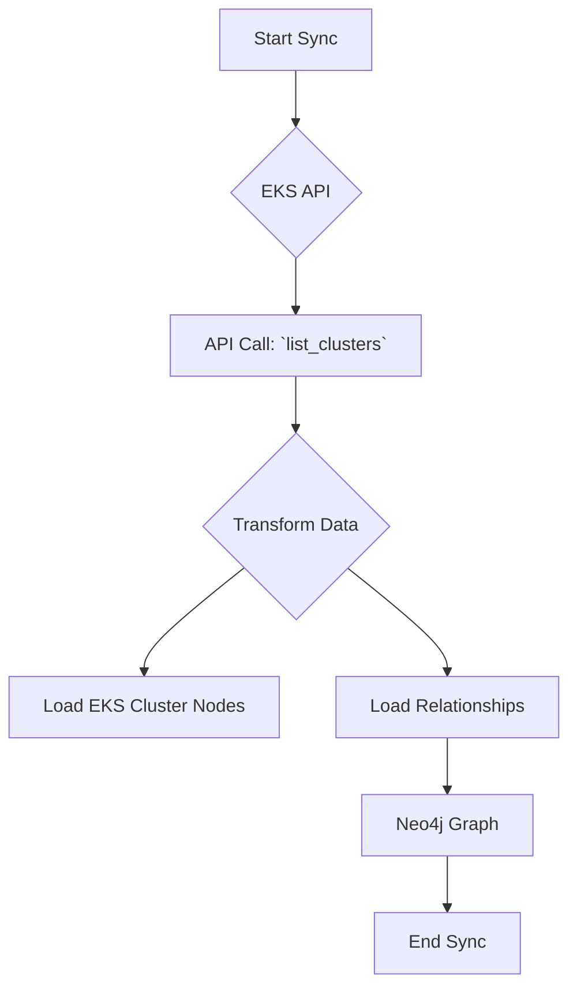

# Technical Requirements: AWS EKS Intelligence Module

This document provides a comprehensive technical breakdown of the AWS EKS intelligence module within Cartography. It is intended for developers who need to understand, integrate, and maintain this module.

## 🏗️ Overview and Implementation Details

### Module Name and Purpose

*   **Module Name:** `cartography.intel.aws.eks.py`
*   **Purpose:** This module discovers Elastic Kubernetes Service (EKS) clusters and their configurations.

### Data Flow

The module queries the EKS API, transforms the responses, and loads the data into Neo4j.



---

## ETL Process: End-to-End Data Flow

This section details the full Extract, Transform, and Load process for EKS.

### 1. Extract

*   **Source Code:**
    *   **File:** `cartography.intel.aws.eks.py`
    *   **Function:** `get_eks_clusters()`

*   **Process:**
    This function retrieves a list of all EKS cluster names in a given region. For each cluster, it then calls `describe_cluster` to get detailed information.

*   **Input Data (Sample Raw JSON from `describe_cluster`):**

    ```json
    {
        "cluster": {
            "name": "MyEKSCluster",
            "arn": "arn:aws:eks:us-east-1:123456789012:cluster/MyEKSCluster",
            "createdAt": 1609459200,
            "version": "1.21",
            "endpoint": "https://xxxxxxxxxxxxxxxxxxxxxxxxxxxxxx.gr7.us-east-1.eks.amazonaws.com",
            "roleArn": "arn:aws:iam::123456789012:role/EKSClusterRole",
            "resourcesVpcConfig": {
                "subnetIds": [
                    "subnet-xxxxxxxx",
                    "subnet-yyyyyyyy"
                ],
                "securityGroupIds": [
                    "sg-xxxxxxxx"
                ],
                "endpointPublicAccess": true
            },
            "status": "ACTIVE"
        }
    }
    ```

### 2. Transform

*   **Source Code:**
    *   **File:** `cartography.intel.aws.eks.py`
    *   **Function:** `transform_eks_clusters()`

*   **Process:**
    The `transform_eks_clusters` function processes the detailed cluster information, extracting key properties and creating a flattened dictionary for each cluster.

*   **Transformed Data Structure (Example for a Cluster):**

    ```python
    [
        {
            "arn": "arn:aws:eks:us-east-1:123456789012:cluster/MyEKSCluster",
            "name": "MyEKSCluster",
            "endpoint": "https://xxxxxxxxxxxxxxxxxxxxxxxxxxxxxx.gr7.us-east-1.eks.amazonaws.com",
            "roleArn": "arn:aws:iam::123456789012:role/EKSClusterRole",
            "version": "1.21",
            "region": "us-east-1",
            "created_at": 1609459200
        }
    ]
    ```

### 3. Load

*   **Source Code:**
    *   **File:** `cartography.intel.aws.eks.py`
    *   **Function:** `load_eks_clusters()`

*   **Graph Schema:**
    *   `cartography.models.aws.eks.clusters.EKSClusterSchema`

*   **Process:**
    The `load_eks_clusters` function uses Cartography's generic `load()` transaction helper to `MERGE` the EKS cluster nodes and their relationships into the graph.

*   **Output Queries (Sample Cypher):**

    ```cypher
    // Load the main EKS cluster node
    MERGE (n:EKSCluster{id: {arn}})
    SET n.name = {name},
        n.endpoint = {endpoint},
        n.rolearn = {roleArn},
        n.version = {version},
        n.region = {region},
        n.created_at = {created_at},
        n.lastupdated = {UPDATE_TAG}

    // Load a relationship to the IAM role
    MATCH (cluster:EKSCluster{id: {arn}})
    MATCH (role:AWSRole{arn: {roleArn}})
    MERGE (cluster)-[r:USES_ROLE]->(role)
    SET r.lastupdated = {UPDATE_TAG}
    ```
