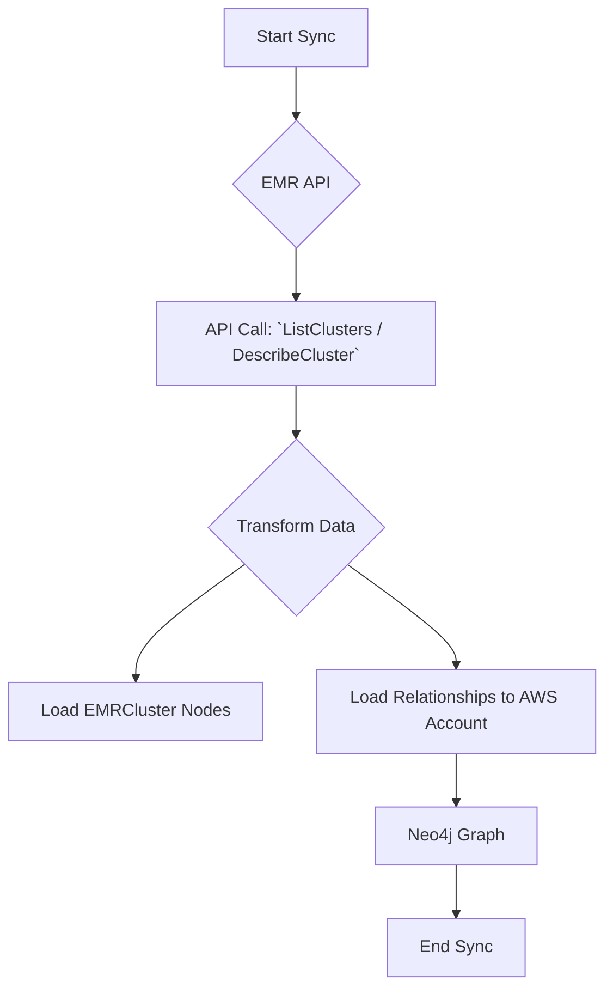

# Technical Requirements: AWS EMR Intelligence Module

This document provides a comprehensive technical breakdown of the AWS EMR intelligence module within Cartography. It is intended for developers who need to understand, integrate, and maintain this module.

## 🏗️ Overview and Implementation Details

### Module Name and Purpose

*   **Module Name:** `cartography.intel.aws.emr.py`
*   **Purpose:** This module is responsible for discovering Amazon EMR clusters and their key configuration details.

### Data Flow

The module queries the EMR API, performs a transformation to extract relevant cluster properties, and then loads this data into Neo4j.



---

## ETL Process: End-to-End Data Flow

This section details the full Extract, Transform, and Load process for EMR clusters.

### 1. Extract

*   **Source Code:**
    *   **File:** `cartography.intel.aws.emr.py`
    *   **Function:** `get_emr_clusters()`

*   **Process:**
    This function uses `boto3` to call `list_clusters()` to retrieve a summary of all clusters in a given region. It then iterates through this list and calls `describe_cluster()` for each cluster ID to fetch its detailed configuration.

*   **Input Data (Sample Raw JSON from `DescribeCluster`):**

    ```json
    {
      "Cluster": {
        "Id": "j-2A63XXXXXX",
        "Name": "my-emr-cluster",
        "Status": {
          "State": "WAITING",
          "StateChangeReason": {
            "Message": "Cluster ready after last step."
          }
        },
        "Ec2InstanceAttributes": {
          "Ec2SubnetId": "subnet-xxxxxxxx",
          "Ec2KeyName": "my-key-pair"
        },
        "InstanceCollectionType": "INSTANCE_FLEET",
        "LogUri": "s3://aws-logs-xxxxxxxx-us-east-1/elasticmapreduce/",
        "ReleaseLabel": "emr-6.2.0",
        "VisibleToAllUsers": true,
        "ServiceRole": "EMR_DefaultRole",
        "NormalizedInstanceHours": 32,
        "MasterPublicDnsName": "ec2-xx-xx-xx-xx.compute-1.amazonaws.com",
        "ClusterArn": "arn:aws:elasticmapreduce:us-east-1:123456789012:cluster/j-2A63XXXXXX"
      }
    }
    ```

### 2. Transform

*   **Source Code:**
    *   **File:** `cartography.intel.aws.emr.py`
    *   **Function:** The transformation logic is contained within the main `sync()` function.

*   **Process:**
    The `sync()` function iterates over the detailed cluster objects returned by `get_emr_clusters()`. For each cluster, it extracts relevant properties and builds a new dictionary that is added to a list for loading.

*   **Transformed Data Structure (Example):**

    ```python
    [
      {
        "Id": "arn:aws:elasticmapreduce:us-east-1:123456789012:cluster/j-2A63XXXXXX",
        "Name": "my-emr-cluster",
        "MasterPublicDnsName": "ec2-xx-xx-xx-xx.compute-1.amazonaws.com",
        "StatusState": "WAITING",
        "LogUri": "s3://aws-logs-xxxxxxxx-us-east-1/elasticmapreduce/",
        "ReleaseLabel": "emr-6.2.0",
        "ServiceRole": "EMR_DefaultRole",
        "Region": "us-east-1"
      }
    ]
    ```

### 3. Load

*   **Source Code:**
    *   **File:** `cartography.intel.aws.emr.py`
    *   **Function:** `load_emr_clusters()`

*   **Graph Schema:**
    *   `cartography.models.aws.emr.EMRClusterSchema`
    *   `cartography.models.aws.emr.EMRClusterToAWSAccount`

*   **Process:**
    The `load_emr_clusters()` function uses Cartography's generic `load()` transaction helper. It passes the transformed list of cluster dictionaries and the `EMRClusterSchema` object to `MERGE` the cluster nodes and their properties into the graph. It then establishes the relationship to the parent `AWSAccount`.

*   **Output Queries (Sample Cypher):**

    ```cypher
    // Load the main EMRCluster node
    MERGE (n:EMRCluster{id: {Id}})
    SET n.name = {Name},
        n.masterpublicdnsname = {MasterPublicDnsName},
        n.statusstate = {StatusState},
        n.loguri = {LogUri},
        n.releaselabel = {ReleaseLabel},
        n.servicerole = {ServiceRole},
        n.region = {Region},
        n.lastupdated = {UPDATE_TAG}

    // Load the relationship to the AWS Account
    MATCH (n:EMRCluster{id: {Id}})
    MATCH (o:AWSAccount{id: {AWS_ID}})
    MERGE (o)-[r:RESOURCE]->(n)
    SET r.lastupdated = {UPDATE_TAG}
    ```
