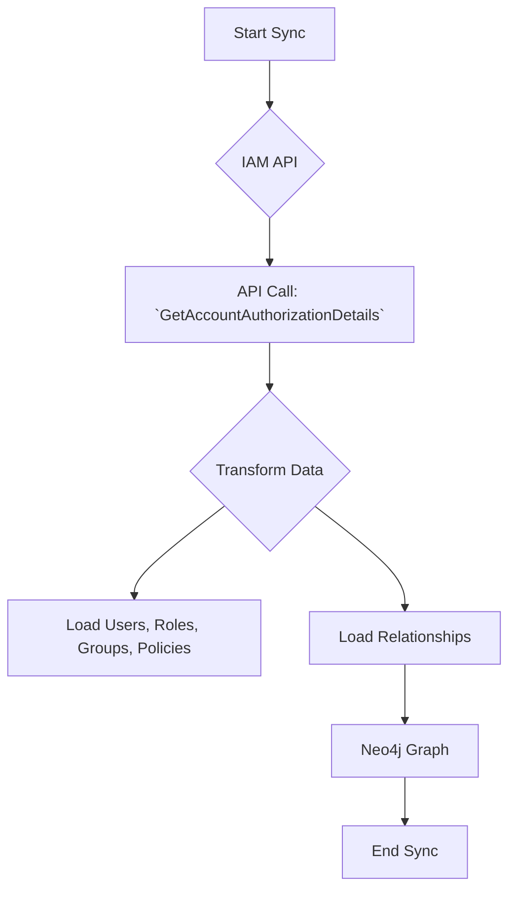

# Technical Requirements: AWS IAM Intelligence Module

This document provides a comprehensive technical breakdown of the AWS IAM intelligence module within Cartography. It is intended for developers who need to understand, integrate, and maintain this module.

## 🏗️ Overview and Implementation Details

### Module Name and Purpose

*   **Module Name:** `cartography.intel.aws.iam.py`
*   **Purpose:** This module is responsible for discovering IAM users, roles, groups, and policies, and mapping the relationships between them.

### Data Flow

The module queries the IAM API, performs a transformation to model the entities and their relationships, and then loads this data into Neo4j.



---

## ETL Process: End-to-End Data Flow

This section details the full Extract, Transform, and Load process for IAM.

### 1. Extract

*   **Source Code:**
    *   **File:** `cartography.intel.aws.iam.py`
    *   **Function:** `get_account_authorization_details()`

*   **Process:**
    This function makes a single, powerful API call to `get_account_authorization_details`. This call returns a large, detailed JSON object containing nearly all IAM configuration for an account, including users, groups, roles, customer-managed policies, and their relationships.

*   **Input Data (Sample Raw JSON from API - Simplified):**

    ```json
    {
      "UserDetailList": [
        {
          "UserId": "AIDACKCEVS45WXXXXXX",
          "Arn": "arn:aws:iam::123456789012:user/my-user",
          "CreateDate": "2023-01-01T12:00:00Z",
          "GroupList": ["my-group"],
          "AttachedManagedPolicies": [
            {
              "PolicyArn": "arn:aws:iam::aws:policy/ReadOnlyAccess"
            }
          ]
        }
      ],
      "GroupDetailList": [
        {
          "GroupId": "AGPACKCEVS45WYYYYYY",
          "Arn": "arn:aws:iam::123456789012:group/my-group",
          "AttachedManagedPolicies": []
        }
      ],
      "RoleDetailList": [],
      "Policies": []
    }
    ```

### 2. Transform

*   **Source Code:**
    *   **File:** `cartography.intel.aws.iam.py`
    *   **Function:** `transform_account_authorization_details()`

*   **Process:**
    This function takes the large JSON object from the extract step and de-normalizes it. It iterates through the `UserDetailList`, `GroupDetailList`, etc., and creates separate, flat lists of dictionaries for each entity type (users, groups, roles, policies) and for the relationships between them (e.g., user-to-group, group-to-policy).

*   **Transformed Data Structure (Example):**
    The result is a tuple containing multiple lists. Here are two examples:

    **Users:**
    ```python
    [
        {
            "arn": "arn:aws:iam::123456789012:user/my-user",
            "userid": "AIDACKCEVS45WXXXXXX",
            "createdate": "2023-01-01T12:00:00Z"
        }
    ]
    ```

    **User-to-Group Relationships:**
    ```python
    [
        {
            "MEMBER_ARN": "arn:aws:iam::123456789012:user/my-user",
            "GROUP_ARN": "arn:aws:iam::123456789012:group/my-group"
        }
    ]
    ```

### 3. Load

*   **Source Code:**
    *   **File:** `cartography.intel.aws.iam.py`
    *   **Function:** `load_account_authorization_details()`

*   **Graph Schema:**
    *   `cartography.models.aws.iam.IAMUserSchema`
    *   `cartography.models.aws.iam.IAMGroupSchema`
    *   `cartography.models.aws.iam.IAMRoleSchema`
    *   `cartography.models.aws.iam.AWSPolicySchema`
    *   `cartography.models.aws.iam.IAMGroupMembershipSchema`
    *   `cartography.models.aws.iam.IAMUserPolicyAttachmentSchema`
    *   `cartography.models.aws.iam.IAMGroupPolicyAttachmentSchema`
    *   ... and others.

*   **Process:**
    The `load_...()` function orchestrates the loading of all the different lists from the transform step. It calls Cartography's generic `load()` function for each entity and relationship type, passing the data and the appropriate schema object.

*   **Output Queries (Sample Cypher):**

    ```cypher
    // Load the IAMUser node
    MERGE (n:IAMUser{id: {arn}})
    SET n.userid = {userid},
        n.createdate = {createdate},
        n.lastupdated = {UPDATE_TAG}

    // Load the IAMGroup node
    MERGE (n:IAMGroup{id: {arn}})
    SET n.groupid = {groupid},
        n.lastupdated = {UPDATE_TAG}

    // Load the user-to-group relationship
    MATCH (u:IAMUser{id: {MEMBER_ARN}})
    MATCH (g:IAMGroup{id: {GROUP_ARN}})
    MERGE (u)-[r:MEMBER_OF_GROUP]->(g)
    SET r.lastupdated = {UPDATE_TAG}
    ```
