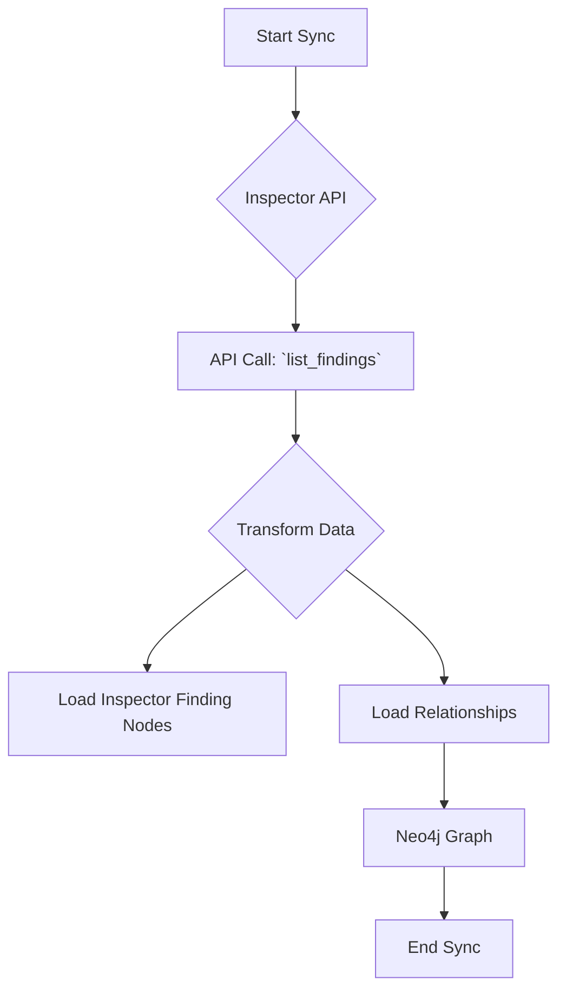

# Technical Requirements: AWS Inspector Intelligence Module

This document provides a comprehensive technical breakdown of the AWS Inspector intelligence module within Cartography. It is intended for developers who need to understand, integrate, and maintain this module.

## 🏗️ Overview and Implementation Details

### Module Name and Purpose

*   **Module Name:** `cartography.intel.aws.inspector.py`
*   **Purpose:** This module discovers AWS Inspector findings and the packages they are associated with.

### Data Flow

The module queries the Inspector API, transforms the responses, and loads the data into Neo4j.



---

## ETL Process: End-to-End Data Flow

This section details the full Extract, Transform, and Load process for Inspector.

### 1. Extract

*   **Source Code:**
    *   **File:** `cartography.intel.aws.inspector.py`
    *   **Function:** `get_findings()`

*   **Process:**
    This function retrieves a list of all Inspector findings in a given region. For each finding, it then calls `describe_findings` to get detailed information.

*   **Input Data (Sample Raw JSON from `describe_findings`):**

    ```json
    {
        "findings": [
            {
                "arn": "arn:aws:inspector:us-east-1:123456789012:assessement/0-xxxxxxxx/run/0-yyyyyyyy/finding/0-zzzzzzzz",
                "title": "CVE-2021-44228 - Log4j Vulnerability",
                "severity": "HIGH",
                "packageVulnerabilityDetails": {
                    "vulnerabilityId": "CVE-2021-44228",
                    "vulnerablePackages": [
                        {
                            "name": "log4j",
                            "version": "2.14.1"
                        }
                    ]
                }
            }
        ]
    }
    ```

### 2. Transform

*   **Source Code:**
    *   **File:** `cartography.intel.aws.inspector.py`
    *   **Function:** `transform_findings()`

*   **Process:**
    The `transform_findings` function processes the detailed finding information, extracting key properties and creating flattened dictionaries for each finding and vulnerable package.

*   **Transformed Data Structure (Example for a Finding):**

    ```python
    [
        {
            "arn": "arn:aws:inspector:us-east-1:123456789012:assessement/0-xxxxxxxx/run/0-yyyyyyyy/finding/0-zzzzzzzz",
            "title": "CVE-2021-44228 - Log4j Vulnerability",
            "severity": "HIGH",
            "vulnerability_id": "CVE-2021-44228"
        }
    ]
    ```

### 3. Load

*   **Source Code:**
    *   **File:** `cartography.intel.aws.inspector.py`
    *   **Function:** `load_findings()`

*   **Graph Schema:**
    *   `cartography.models.aws.inspector.findings.InspectorFindingSchema`
    *   `cartography.models.aws.inspector.packages.InspectorPackageSchema`

*   **Process:**
    The `load_findings` function uses Cartography's generic `load()` transaction helper to `MERGE` the Inspector finding and package nodes and their relationships into the graph.

*   **Output Queries (Sample Cypher):**

    ```cypher
    // Load the main Inspector finding node
    MERGE (n:InspectorFinding{id: {arn}})
    SET n.title = {title},
        n.severity = {severity},
        n.vulnerability_id = {vulnerability_id},
        n.lastupdated = {UPDATE_TAG}

    // Load a relationship to a vulnerable package
    MATCH (finding:InspectorFinding{id: {finding_arn}})
    MATCH (package:InspectorPackage{id: {package_arn}})
    MERGE (finding)-[r:HAS_VULNERABLE_PACKAGE]->(package)
    SET r.lastupdated = {UPDATE_TAG}
    ```
