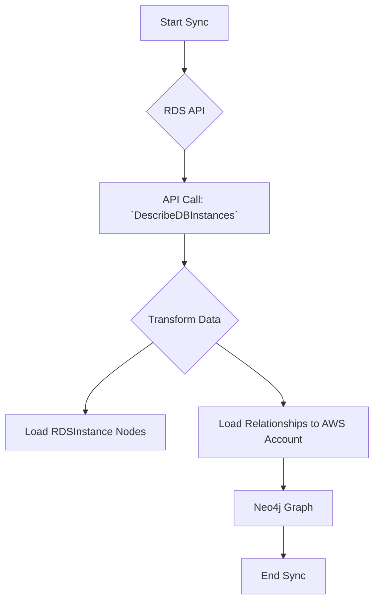

# Technical Requirements: AWS RDS Intelligence Module

This document provides a comprehensive technical breakdown of the AWS RDS intelligence module within Cartography. It is intended for developers who need to understand, integrate, and maintain this module.

## 🏗️ Overview and Implementation Details

### Module Name and Purpose

*   **Module Name:** `cartography.intel.aws.rds.py`
*   **Purpose:** This module discovers Amazon Relational Database Service (RDS) instances and their detailed configurations.

### Data Flow

The module queries the RDS API, transforms the response to extract relevant instance properties, and then loads this data into Neo4j.



---

## ETL Process: End-to-End Data Flow

This section details the full Extract, Transform, and Load process for RDS instances.

### 1. Extract

*   **Source Code:**
    *   **File:** `cartography.intel.aws.rds.py`
    *   **Function:** `get_rds_instances()`

*   **Process:**
    This function uses `boto3` to make a paginated call to the `describe_db_instances` API. This ensures that all RDS instances within a given region are retrieved, even in accounts with many instances.

*   **Input Data (Sample Raw JSON from API):**

    ```json
    {
      "DBInstances": [
        {
          "DBInstanceIdentifier": "my-rds-instance",
          "DBInstanceClass": "db.t3.micro",
          "Engine": "postgres",
          "DBInstanceStatus": "available",
          "MasterUsername": "myuser",
          "DBName": "mydatabase",
          "Endpoint": {
            "Address": "my-rds-instance.xxxxxxxx.us-east-1.rds.amazonaws.com",
            "Port": 5432
          },
          "DBInstanceArn": "arn:aws:rds:us-east-1:123456789012:db:my-rds-instance",
          "VpcSecurityGroups": [
            {
              "VpcSecurityGroupId": "sg-xxxxxxxx",
              "Status": "active"
            }
          ]
        }
      ]
    }
    ```

### 2. Transform

*   **Source Code:**
    *   **File:** `cartography.intel.aws.rds.py`
    *   **Function:** `transform_rds_instances()`

*   **Process:**
    This function iterates through the list of DB instances returned by the `get_rds_instances` function. It extracts key properties from each instance object and creates a new, flattened dictionary for each one, which is then added to a list for loading.

*   **Transformed Data Structure (Example):**

    ```python
    [
        {
            "DBInstanceIdentifier": "my-rds-instance",
            "DBInstanceArn": "arn:aws:rds:us-east-1:123456789012:db:my-rds-instance",
            "DBInstanceClass": "db.t3.micro",
            "Engine": "postgres",
            "DBInstanceStatus": "available",
            "EndpointAddress": "my-rds-instance.xxxxxxxx.us-east-1.rds.amazonaws.com",
            "EndpointPort": 5432,
            "region": "us-east-1"
        }
    ]
    ```

### 3. Load

*   **Source Code:**
    *   **File:** `cartography.intel.aws.rds.py`
    *   **Function:** `load_rds_instances()`

*   **Graph Schema:**
    *   `cartography.models.aws.rds.RDSInstanceSchema`
    *   `cartography.models.aws.rds.RDSInstanceToAWSAccount`

*   **Process:**
    The `load_rds_instances()` function uses Cartography's generic `load()` transaction helper. It passes the transformed list of instance dictionaries and the `RDSInstanceSchema` object to `MERGE` the instance nodes and their properties into the graph. It also establishes the relationship to the parent `AWSAccount`.

*   **Output Queries (Sample Cypher):**

    ```cypher
    // Load the main RDSInstance node
    MERGE (n:RDSInstance{id: {DBInstanceArn}})
    SET n.db_instance_identifier = {DBInstanceIdentifier},
        n.arn = {DBInstanceArn},
        n.db_instance_class = {DBInstanceClass},
        n.engine = {Engine},
        n.db_instance_status = {DBInstanceStatus},
        n.endpoint_address = {EndpointAddress},
        n.endpoint_port = {EndpointPort},
        n.region = {region},
        n.lastupdated = {UPDATE_TAG}

    // Load the relationship to the AWS Account
    MATCH (n:RDSInstance{id: {DBInstanceArn}})
    MATCH (o:AWSAccount{id: {AWS_ID}})
    MERGE (o)-[r:RESOURCE]->(n)
    SET r.lastupdated = {UPDATE_TAG}
    ```
