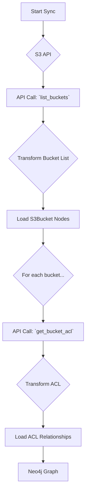

# Technical Requirements: AWS S3 Intelligence Module

This document provides a comprehensive technical breakdown of the AWS S3 intelligence module within Cartography. It is intended for developers who need to understand, integrate, and maintain this module.

## 🏗️ Overview and Implementation Details

### Module Name and Purpose

*   **Module Name:** `cartography.intel.aws.s3.py`
*   **Purpose:** This module is responsible for discovering Amazon S3 buckets and their detailed configurations, including ACLs, encryption settings, public access blocks, and replication policies.

### Data Flow

The module queries the S3 API, performs a transformation, and loads the data into Neo4j. This process is repeated for various bucket properties.



---

## ETL Process: End-to-End Data Flow

This section details the ETL process for the core S3 bucket discovery.

### 1. Extract

*   **Source Code:**
    *   **File:** `cartography.intel.aws.s3.py`
    *   **Function:** `get_s3_buckets()`

*   **Process:**
    The function calls the `s3:ListBuckets` API. This is a global call that does not require a region and returns a list of all S3 buckets owned by the account.

*   **Input Data (Sample Raw JSON from API):**
    A simplified response from `list_buckets`.

    ```json
    {
      "Buckets": [
        {
          "Name": "my-sample-bucket",
          "CreationDate": "2023-01-01T12:00:00Z"
        }
      ],
      "Owner": {
        "DisplayName": "owner-name",
        "ID": "owner-id"
      }
    }
    ```

### 2. Transform

*   **Source Code:**
    *   **File:** `cartography.intel.aws.s3.py`
    *   **Function:** `get_s3_buckets()` (Transformation is in the same function)

*   **Process:**
    The `get_s3_buckets` function immediately processes the API response. It iterates through the list of buckets and enriches each one with the AWS Account ID. It also determines the region for each bucket by making a `s3:GetBucketLocation` call.

*   **Transformed Data Structure (Example):**
    A list of bucket dictionaries is generated.

    ```python
    [
      {
        "Name": "my-sample-bucket",
        "CreationDate": "2023-01-01T12:00:00Z",
        "OwnerId": "owner-id",
        "OwnerDisplayName": "owner-name",
        "Location": "us-east-1",
        "AWS_ID": "123456789012"
      }
    ]
    ```

### 3. Load

*   **Source Code:**
    *   **File:** `cartography.intel.aws.s3.py`
    *   **Function:** `load_s3_buckets()`

*   **Graph Schema:**
    *   `S3BucketSchema`
    *   `S3BucketToAWSAccountSchema`

*   **Process:**
    The `load_s3_buckets()` function takes the list of transformed bucket dictionaries and uses the `load()` utility to merge them into the graph. It creates `S3Bucket` nodes and connects them to the parent `AWSAccount` node.

*   **Output Queries (Sample Cypher):**

    ```cypher
    // Load the S3Bucket node
    MERGE (n:S3Bucket{id: {Name}})
    SET n.creationdate = {CreationDate},
        n.region = {Location},
        n.lastupdated = {UPDATE_TAG}

    // Load the relationship to the AWS Account
    MATCH (b:S3Bucket{id: {Name}})
    MATCH (a:AWSAccount{id: {AWS_ID}})
    MERGE (a)-[r:RESOURCE]->(b)
    SET r.lastupdated = {UPDATE_TAG}
    ```