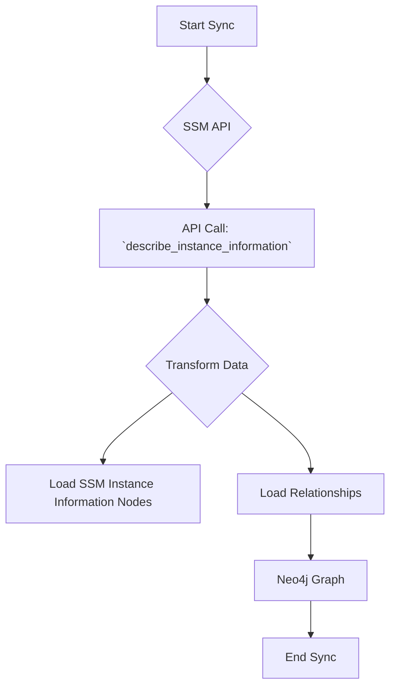

# Technical Requirements: AWS SSM Intelligence Module

This document provides a comprehensive technical breakdown of the AWS SSM intelligence module within Cartography. It is intended for developers who need to understand, integrate, and maintain this module.

## 🏗️ Overview and Implementation Details

### Module Name and Purpose

*   **Module Name:** `cartography.intel.aws.ssm.py`
*   **Purpose:** This module discovers AWS Systems Manager (SSM) instance information and patch compliance.

### Data Flow

The module queries the SSM API, transforms the responses, and loads the data into Neo4j.



---

## ETL Process: End-to-End Data Flow

This section details the full Extract, Transform, and Load process for SSM.

### 1. Extract

*   **Source Code:**
    *   **File:** `cartography.intel.aws.ssm.py`
    *   **Function:** `get_instance_information()`

*   **Process:**
    This function retrieves a list of all managed instances in a given region. For each instance, it then calls `describe_instance_patches` to get patch compliance information.

*   **Input Data (Sample Raw JSON from `describe_instance_information`):**

    ```json
    {
        "InstanceInformationList": [
            {
                "InstanceId": "i-0123456789abcdef0",
                "PingStatus": "Online",
                "PlatformType": "Linux",
                "PlatformName": "Amazon Linux",
                "PlatformVersion": "2",
                "IPAddress": "10.0.0.1",
                "ComputerName": "ip-10-0-0-1.ec2.internal"
            }
        ]
    }
    ```

### 2. Transform

*   **Source Code:**
    *   **File:** `cartography.intel.aws.ssm.py`
    *   **Function:** The transformation logic is contained within the main `sync` function.

*   **Process:**
    The `sync` function processes the instance information and patch data, creating flattened dictionaries for each.

*   **Transformed Data Structure (Example for Instance Information):**

    ```python
    [
        {
            "instance_id": "i-0123456789abcdef0",
            "ping_status": "Online",
            "platform_type": "Linux",
            "platform_name": "Amazon Linux",
            "platform_version": "2",
            "ip_address": "10.0.0.1",
            "computer_name": "ip-10-0-0-1.ec2.internal",
            "region": "us-east-1"
        }
    ]
    ```

### 3. Load

*   **Source Code:**
    *   **File:** `cartography.intel.aws.ssm.py`
    *   **Function:** `load_instance_information()` and `load_instance_patches()`

*   **Graph Schema:**
    *   `cartography.models.aws.ssm.instance_information.SSMInstanceInformationSchema`
    *   `cartography.models.aws.ssm.instance_patch.SSMInstancePatchSchema`

*   **Process:**
    The `load_*` functions use Cartography's generic `load()` transaction helper to `MERGE` the SSM instance information and patch nodes and their relationships into the graph.

*   **Output Queries (Sample Cypher):**

    ```cypher
    // Load the main SSM instance information node
    MERGE (n:SSMInstance{id: {instance_id}})
    SET n.ping_status = {ping_status},
        n.platform_type = {platform_type},
        n.platform_name = {platform_name},
        n.platform_version = {platform_version},
        n.ip_address = {ip_address},
        n.computer_name = {computer_name},
        n.region = {region},
        n.lastupdated = {UPDATE_TAG}

    // Load a relationship to the EC2 instance
    MATCH (ssm:SSMInstance{id: {instance_id}})
    MATCH (ec2:EC2Instance{instanceid: {instance_id}})
    MERGE (ssm)-[r:APPLIES_TO]->(ec2)
    SET r.lastupdated = {UPDATE_TAG}
    ```
