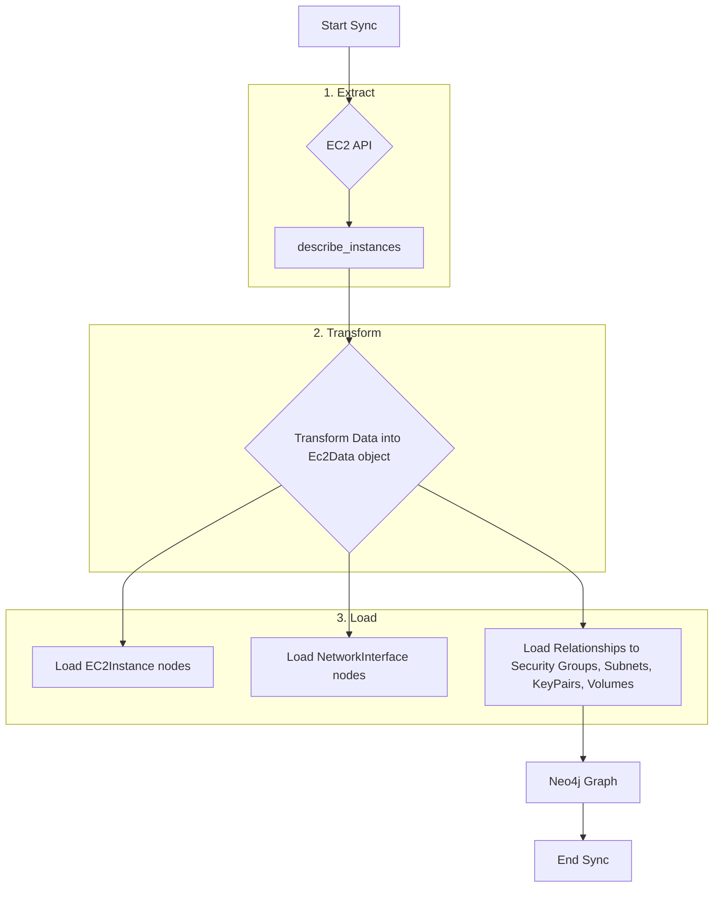
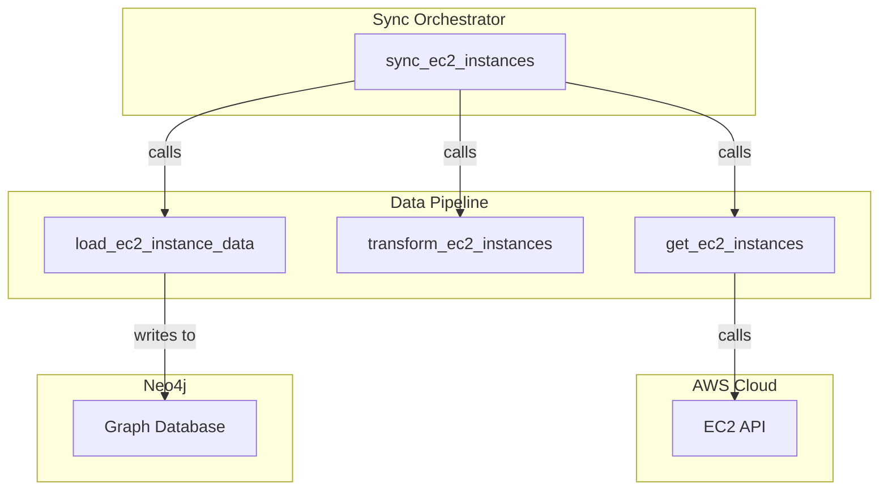

# Technical Requirements: AWS EC2 Instances Intelligence Module

This document provides a comprehensive technical breakdown of the AWS EC2 Instances intelligence module within Cartography. It is intended for developers who need to understand, integrate, and maintain this module.

## 🏗️ Overview and Implementation Details

### Module Name and Purpose

*   **Module Name:** `cartography.intel.aws.ec2.instances.py`
*   **Purpose:** This is a comprehensive module responsible for discovering and modeling EC2 instances and their rich set of related components. It captures not just the instances themselves, but also their network interfaces, security groups, key pairs, EBS volume attachments, and more.

### Data Flow

The module queries the EC2 API, performs a complex transformation to de-normalize the response into a graph structure, and then loads this data into Neo4j using a series of model-based loaders.



### Technology Stack

*   **Programming Language:** Python
*   **Core Libraries:**
    *   `boto3`: The AWS SDK for Python.
    *   `neo4j`: The official Python driver for Neo4j.

### Core Logic/Algorithm

1.  **Iterate Regions:** The sync runs for each configured AWS region.
2.  **Fetch Instance Data:** The `get_ec2_instances` function uses a paginator for the `ec2:DescribeInstances` API call. This API returns a deeply nested structure containing all information about instances within a "reservation."
3.  **Complex Transformation:** The `transform_ec2_instances` function is the heart of the module. It takes the raw list of reservations and de-normalizes it into a flat, graph-friendly structure. It iterates through each instance and extracts:
    *   The instance's core properties (ID, type, state, etc.).
    *   Its relationship to a Subnet.
    *   Its relationship to a KeyPair.
    *   Its relationships to one or more Security Groups.
    *   Details of its Network Interfaces (ENIs) and their relationships.
    *   Details of its attached EBS volumes.
    All of this data is organized into lists within a named tuple called `Ec2Data`.
4.  **Modular Loading:** The `load_ec2_instance_data` function orchestrates the loading process. It calls a series of specific `load_*` functions, one for each type of data in the `Ec2Data` tuple (e.g., `load_ec2_instance_nodes`, `load_ec2_subnets`, `load_ec2_security_groups`).
5.  **Schema-Based Ingestion:** Each `load_*` function uses Cartography's generic `load()` transaction helper, passing the relevant list of data and a corresponding `*Schema` object (e.g., `EC2InstanceSchema`, `EC2SubnetInstanceSchema`). These schema objects define the Cypher queries needed to `MERGE` the nodes and relationships.
6.  **Cleanup:** The `cleanup` function runs multiple `GraphJob`s based on various schemas. This is critical for ensuring that stale relationships are removed. For example, if an instance is terminated, this job will remove the instance node and all its relationships from the graph.

### Dependencies

*   **External:** `boto3`, `neo4j-driver`
*   **Internal (Cartography):** This module relies heavily on the schema-based loading mechanism.
    *   `cartography.client.core.tx.load`: The generic data loading function.
    *   `cartography.graph.job.GraphJob`: For schema-based cleanup.
    *   A wide range of `*Schema` objects from `cartography.models.aws.ec2.*`, which define the graph structure for each component.

---

## 🏛️ Architecture and Structure

### System Integration

This module is a central hub for AWS compute and network information. It relies on other modules having run first, such as `security_groups.py` and `subnets.py` (not shown here, but part of the sync), as it will attempt to link to nodes they create. Its own output (`:EC2Instance` nodes) is a prerequisite for many other modules, such as those that inspect instance metadata or installed software.

### Internal Components

*   **Main Entry Point:**
    *   `sync_ec2_instances()`: Orchestrates the region iteration and calls the get, transform, and load functions.
*   **Data Fetching:**
    *   `get_ec2_instances()`: Fetches the raw `describe_instances` data.
*   **Data Transformation:**
    *   `transform_ec2_instances()`: The key transformation logic, producing the `Ec2Data` named tuple.
*   **Data Loading:**
    *   `load_ec2_instance_data()`: The orchestrator for all loading steps.
    *   Multiple `load_*` functions (`load_ec2_instance_nodes`, etc.): Individual loaders for each data type.
*   **Cleanup:**
    *   `cleanup()`: Runs multiple cleanup jobs to remove stale nodes and relationships.

### Mermaid.js Diagram: Component Interactions



---

## 🔗 External Interfaces and Contracts

### A. Public Interface (API)

*   **Main Entry Point:** `sync_ec2_instances(neo4j_session: neo4j.Session, boto3_session: boto3.session.Session, regions: List[str], current_aws_account_id: str, update_tag: int, common_job_parameters: Dict[str, Any])`
*   **Description:** Orchestrates the complete discovery and synchronization of EC2 instances and their related components for an AWS account across multiple regions.
*   **Side Effects:**
    *   Writes/updates a large number of nodes and relationships in the Neo4j graph, including `:EC2Instance`, `:EC2Reservation`, `:NetworkInterface`, and their connections to `:EC2SecurityGroup`, `:Subnet`, `:EBSVolume`, and `:EC2KeyPair`.
    *   Runs multiple cleanup jobs to remove stale data.

### B. Input Specification

*   **`neo4j_session`**: An active `neo4j.Session` object. (Required)
*   **`boto3_session`**: An active `boto3.session.Session` object. (Required)
*   **`regions`**: A `List[str]` of AWS regions to scan. (Required)
*   **`current_aws_account_id`**: The 12-digit ID of the AWS account. (Required)
*   **`update_tag`**: An `int` timestamp for versioning. (Required)
*   **`common_job_parameters`**: A `Dict` for cleanup jobs. (Required)
*   **Input Sources:** Called by the main AWS sync orchestrator.

### C. Output Specification

*   **Output Data Structure:** Returns `None`. Its output is the state change in the Neo4j database.
*   **Error Handling:** Uses the `@aws_handle_regions` decorator for standard Boto3 client error handling.

---

## 🎯 Use Cases and Scenarios

*   **Use Case 1: Comprehensive Instance Inventory**
    *   **Scenario:** An auditor needs a full inventory of all EC2 instances, including their IP addresses, instance type, launch time, and associated key pairs.
    *   **Integration:** A single Cypher query can retrieve this rich, interconnected data:
        ```cypher
        MATCH (i:EC2Instance)-[:USES_KEYPAIR]->(k:EC2KeyPair)
        WHERE i.state = 'running'
        RETURN i.instanceid, i.publicipaddress, i.privateipaddress, i.instancetype, i.launchtime, k.name
        ```

*   **Use Case 2: Network Troubleshooting**
    *   **Scenario:** A network engineer is debugging a connectivity issue and needs to see all the details of an instance's network configuration.
    *   **Integration:** The graph model allows for a deep dive into an instance's network components:
        ```cypher
        MATCH (i:EC2Instance{instanceid: 'i-123...'})-[:HAS_NETWORK_INTERFACE]->(ni:NetworkInterface)
        MATCH (ni)-[:PART_OF_SUBNET]->(s:Subnet)
        MATCH (ni)-[:MEMBER_OF_EC2_SECURITY_GROUP]->(sg:EC2SecurityGroup)
        RETURN i.instanceid, ni.id, ni.privateipaddress, s.id, sg.id
        ```

*   **Use Case 3: Identify Instances with Public IPs**
    *   **Scenario:** A security team wants to find all running EC2 instances that have been assigned a public IP address to assess their external exposure.
    *   **Integration:** A simple property check on the `:EC2Instance` node is sufficient:
        ```cypher
        MATCH (i:EC2Instance)
        WHERE i.state = 'running' AND i.publicipaddress IS NOT NULL
        RETURN i.instanceid, i.publicipaddress, i.region
        ```
---
## Appendix: Source Code for `transform_ec2_instances`

The following is the source code for the `transform_ec2_instances` function, which is responsible for transforming the raw EC2 instance data from the AWS API into a format that can be loaded into Cartography's graph database.

```python
def transform_ec2_instances(reservations: List[Dict[str, Any]], region: str, current_aws_account_id: str) -> Ec2Data:
    reservation_list = []
    instance_list = []
    subnet_list = []
    keypair_list = []
    sg_list = []
    network_interface_list = []
    instance_ebs_volumes_list = []

    for reservation in reservations:
        reservation_id = reservation['ReservationId']
        reservation_list.append({
            'RequesterId': reservation.get('RequesterId'),
            'ReservationId': reservation['ReservationId'],
            'OwnerId': reservation['OwnerId'],
        })
        for instance in reservation['Instances']:
            instance_id = instance['InstanceId']
            launch_time = instance.get("LaunchTime")
            launch_time_unix = str(time.mktime(launch_time.timetuple())) if launch_time else None
            instance_list.append(
                {
                    'InstanceId': instance_id,
                    'ReservationId': reservation_id,
                    'PublicDnsName': instance.get("PublicDnsName"),
                    'PublicIpAddress': instance.get("PublicIpAddress"),
                    'PrivateIpAddress': instance.get("PrivateIpAddress"),
                    'ImageId': instance.get("ImageId"),
                    'InstanceType': instance.get("InstanceType"),
                    'IamInstanceProfile': instance.get("IamInstanceProfile", {}).get("Arn"),
                    'MonitoringState': instance.get("Monitoring", {}).get("State"),
                    'LaunchTime': instance.get("LaunchTime"),
                    'LaunchTimeUnix': launch_time_unix,
                    'State': instance.get("State", {}).get("Name"),
                    'AvailabilityZone': instance.get("Placement", {}).get("AvailabilityZone"),
                    'Tenancy': instance.get("Placement", {}).get("Tenancy"),
                    'HostResourceGroupArn': instance.get("Placement", {}).get("HostResourceGroupArn"),
                    'Platform': instance.get("Platform"),
                    'Architecture': instance.get("Architecture"),
                    'EbsOptimized': instance.get("EbsOptimized"),
                    'BootMode': instance.get("BootMode"),
                    'InstanceLifecycle': instance.get("InstanceLifecycle"),
                    'HibernationOptions': instance.get("HibernationOptions", {}).get("Configured"),
                },
            )

            subnet_id = instance.get('SubnetId')
            if subnet_id:
                subnet_list.append(
                    {
                        'SubnetId': subnet_id,
                        'InstanceId': instance_id,
                    },
                )

            if instance.get("KeyName"):
                key_name = instance["KeyName"]
                key_pair_arn = f'arn:aws:ec2:{region}:{current_aws_account_id}:key-pair/{key_name}'
                keypair_list.append({
                    'KeyPairArn': key_pair_arn,
                    'KeyName': key_name,
                    'InstanceId': instance_id,
                })

            if instance.get("SecurityGroups"):
                for group in instance["SecurityGroups"]:
                    sg_list.append(
                        {
                            'GroupId': group['GroupId'],
                            'InstanceId': instance_id,
                        },
                    )

            for network_interface in instance['NetworkInterfaces']:
                for security_group in network_interface.get('Groups', []):
                    network_interface_list.append({
                        'NetworkInterfaceId': network_interface['NetworkInterfaceId'],
                        'Status': network_interface['Status'],
                        'MacAddress': network_interface['MacAddress'],
                        'Description': network_interface['Description'],
                        'PrivateDnsName': network_interface.get('PrivateDnsName'),
                        'PrivateIpAddress': network_interface['PrivateIpAddress'],
                        'InstanceId': instance_id,
                        'SubnetId': subnet_id,
                        'GroupId': security_group['GroupId'],
                    })

            if 'BlockDeviceMappings' in instance and len(instance['BlockDeviceMappings']) > 0:
                for mapping in instance['BlockDeviceMappings']:
                    if 'VolumeId' in mapping['Ebs']:
                        instance_ebs_volumes_list.append({
                            'InstanceId': instance_id,
                            'VolumeId': mapping['Ebs']['VolumeId'],
                            'DeleteOnTermination': mapping['Ebs']['DeleteOnTermination'],
                            # 'SnapshotId': mapping['Ebs']['SnapshotId'],  # TODO check on this
                        })

    return Ec2Data(
        reservation_list=reservation_list,
        instance_list=instance_list,
        subnet_list=subnet_list,
        sg_list=sg_list,
        keypair_list=keypair_list,
        network_interface_list=network_interface_list,
        instance_ebs_volumes_list=instance_ebs_volumes_list,
    )
```
