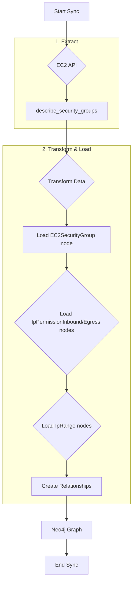
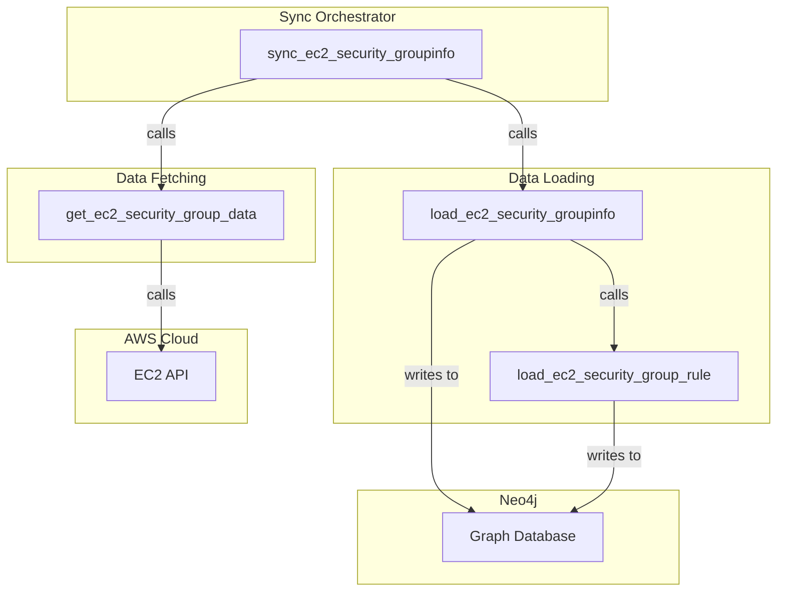

# Technical Requirements: AWS EC2 Security Groups Intelligence Module

This document provides a comprehensive technical breakdown of the AWS EC2 Security Groups intelligence module within Cartography. It is intended for developers who need to understand, integrate, and maintain this module.

## 🏗️ Overview and Implementation Details

### Module Name and Purpose

*   **Module Name:** `cartography.intel.aws.ec2.security_groups.py`
*   **Purpose:** This module discovers all EC2 security groups within an AWS account. It ingests the groups themselves, their inbound and outbound rules, and the IP ranges specified in those rules, creating a detailed network security model in the graph.

### Data Flow

The module extracts security group data from AWS, transforms the complex rule structures into graph-friendly nodes and relationships, and loads them into Neo4j.



### Technology Stack

*   **Programming Language:** Python
*   **Core Libraries:**
    *   `boto3`: The AWS SDK for Python, used to interact with the EC2 API.
    *   `neo4j`: The official Python driver for Neo4j.

### Core Logic/Algorithm

1.  **Iterate Regions:** The sync process is wrapped in the `@aws_handle_regions` decorator, ensuring it runs for each configured AWS region.
2.  **Fetch Security Groups:** In each region, `get_ec2_security_group_data` uses a paginator for the `ec2:DescribeSecurityGroups` API call to retrieve a complete list of all security groups.
3.  **Load Security Group Info:** The `load_ec2_security_groupinfo` function iterates through the retrieved groups. For each group, it `MERGE`s a primary `:EC2SecurityGroup` node and links it to its parent `:AWSAccount` and `:AWSVpc`.
4.  **Load Rules:** For each security group, the function then calls `load_ec2_security_group_rule` twice: once for inbound rules (`IpPermissions`) and once for outbound rules (`IpPermissionsEgress`).
5.  **Load Rule Details:** `load_ec2_security_group_rule` creates a rule node (`:IpPermissionInbound` or `:IpPermissionEgress`, which are also labeled `:IpRule`). It then links this rule node back to the security group.
6.  **Load IP Ranges:** For each rule, the function iterates through the `IpRanges` and `MERGE`s an `:IpRange` node for each CIDR block, linking it to the rule it belongs to.
7.  **Cleanup:** After all regions are synced, `cleanup_ec2_security_groupinfo` is called. It runs two jobs:
    *   A JSON-defined job to remove stale rules and IP ranges.
    *   A `GraphJob` based on `EC2SecurityGroupInstanceSchema` to remove stale relationships between EC2 instances and security groups, ensuring the graph accurately reflects which instances are using which groups.

### Dependencies

*   **External:** `boto3`, `neo4j-driver`
*   **Internal (Cartography):**
    *   `cartography.util.aws_handle_regions`: A decorator for region iteration.
    *   `cartography.util.run_cleanup_job`: For the main cleanup job.
    *   `cartography.graph.job.GraphJob`: For the schema-based cleanup.
    *   `cartography.models.aws.ec2.securitygroup_instance.EC2SecurityGroupInstanceSchema`: A model schema used for cleaning up instance-to-security-group relationships.

---

## 🏛️ Architecture and Structure

### System Integration

This module is a cornerstone of AWS security and network analysis in Cartography. It provides the foundational data for understanding network paths and exposure. It should be run before modules that link resources (like instances, load balancers, or RDS databases) to security groups, as those modules will expect the `:EC2SecurityGroup` nodes to exist.

### Internal Components

*   **Main Entry Point:**
    *   `sync_ec2_security_groupinfo()`: Orchestrates the sync process across all regions.
*   **Data Fetching:**
    *   `get_ec2_security_group_data()`: Fetches the raw security group data from the EC2 API.
*   **Data Loading:**
    *   `load_ec2_security_groupinfo()`: The main loading function that creates the `:EC2SecurityGroup` node and orchestrates the rule loading.
    *   `load_ec2_security_group_rule()`: The detailed loading function responsible for creating `:IpRule` and `:IpRange` nodes and their relationships.
*   **Cleanup:**
    *   `cleanup_ec2_security_groupinfo()`: Manages the removal of stale security group components from the graph.

### Mermaid.js Diagram: Component Interactions



---

## 🔗 External Interfaces and Contracts

### A. Public Interface (API)

*   **Main Entry Point:** `sync_ec2_security_groupinfo(neo4j_session: neo4j.Session, boto3_session: boto3.session.Session, regions: List[str], current_aws_account_id: str, update_tag: int, common_job_parameters: Dict)`
*   **Description:** This function orchestrates the complete discovery and synchronization of EC2 security groups and their rules for a given AWS account across multiple regions.
*   **Side Effects:**
    *   Writes `:EC2SecurityGroup`, `:IpPermissionInbound`, `:IpPermissionEgress`, and `:IpRange` nodes to the Neo4j database.
    *   Creates relationships between these nodes to model the security group structure.
    *   Runs cleanup jobs, which may delete stale security group-related nodes and relationships.

### B. Input Specification

*   **`neo4j_session`**: An active `neo4j.Session` object. (Required)
*   **`boto3_session`**: An active `boto3.session.Session` object. (Required)
*   **`regions`**: A `List[str]` of AWS regions to scan. (Required)
*   **`current_aws_account_id`**: The 12-digit ID of the AWS account being scanned. (Required)
*   **`update_tag`**: An `int` timestamp for versioning the sync run. (Required)
*   **`common_job_parameters`**: A `Dict` containing metadata for the cleanup jobs. (Required)
*   **Input Sources:** Called by the main AWS sync orchestrator.

### C. Output Specification

*   **Output Data Structure:** Returns `None`. Its output is the state change in the Neo4j database.
*   **Error Handling:** The `get_ec2_security_group_data` function is decorated with `@aws_handle_regions`, which provides standard error handling for Boto3 client exceptions, preventing crashes and ensuring the sync can continue with other regions.

---

## 🎯 Use Cases and Scenarios

*   **Use Case 1: Detect Unrestricted Inbound Access**
    *   **Scenario:** A security analyst needs to find all security groups that allow unrestricted access (from `0.0.0.0/0`) to sensitive ports like SSH (22) or RDP (3389).
    *   **Integration:** This critical security check can be performed with a Cypher query on the graph populated by this module:
        ```cypher
        MATCH (group:EC2SecurityGroup)<-[:MEMBER_OF_EC2_SECURITY_GROUP]-(rule:IpPermissionInbound)
        MATCH (rule)<-[:MEMBER_OF_IP_RULE]-(ip:IpRange)
        WHERE ip.id = '0.0.0.0/0' AND (rule.fromport <= 22 AND rule.toport >= 22)
        RETURN group.id, group.name, rule.fromport, rule.toport
        ```

*   **Use Case 2: Audit Outbound Traffic Rules**
    *   **Scenario:** A compliance officer wants to ensure that no security groups allow unrestricted outbound traffic (`0.0.0.0/0`) on all ports, which could be a data exfiltration vector.
    *   **Integration:** A query can identify these overly permissive egress rules:
        ```cypher
        MATCH (group:EC2SecurityGroup)<-[:MEMBER_OF_EC2_SECURITY_GROUP]-(rule:IpPermissionEgress)
        MATCH (rule)<-[:MEMBER_OF_IP_RULE]-(ip:IpRange)
        WHERE ip.id = '0.0.0.0/0' AND rule.protocol = 'all'
        RETURN group.id, group.name
        ```

*   **Use Case 3: Inventory Security Groups in a VPC**
    *   **Scenario:** A network administrator needs to list all security groups associated with a particular VPC to review its overall security posture.
    *   **Integration:** The relationship between the VPC and the security group makes this straightforward:
        ```cypher
        MATCH (vpc:AWSVpc{id: 'vpc-12345678'})-[]->(group:EC2SecurityGroup)
        RETURN group.id, group.name, group.description
        ```
