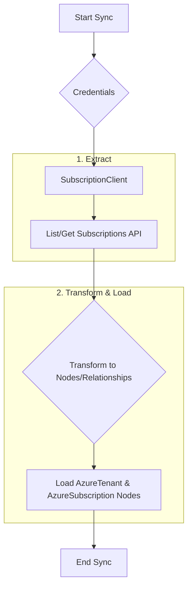
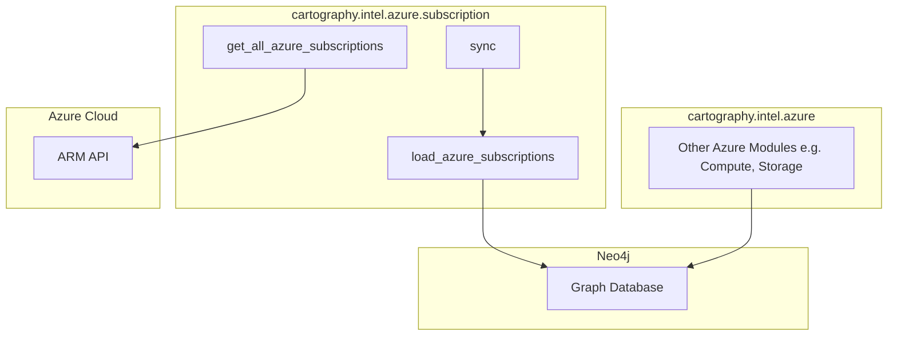

# Technical Requirements: Azure Subscription Intelligence Module

This document provides a comprehensive technical breakdown of the Azure Subscription intelligence module within Cartography. It is intended for developers who need to understand, integrate, and maintain this foundational piece of the Azure sync.

## 🏗️ Overview and Implementation Details

### Module Name and Purpose

*   **Module Name:** `cartography.intel.azure.subscription.py`
*   **Purpose:** The primary objective of this module is to collect metadata about Azure Subscriptions that are accessible with a given set of credentials. It then models this data in a Neo4j graph database, establishing the top-level resource containers for an Azure tenant.

### Data Flow

The module extracts subscription data from Azure, transforms it into a graph structure, and loads it into Neo4j. This data forms the basis for most other Azure intelligence modules.



### Technology Stack

*   **Programming Language:** Python
*   **Core Libraries:**
    *   `azure-mgmt-resource`: The Azure SDK for Python, used to interact with the Azure Resource Manager (ARM) API to get subscription details.
    *   `neo4j`: The official Python driver for Neo4j, used to execute Cypher queries.

### Core Logic/Algorithm

The module's logic is straightforward:

1.  **Initialize Client:** Using the provided Azure credentials, it creates a `SubscriptionClient`.
2.  **Fetch Subscriptions:** It calls the `subscriptions.list()` or `subscriptions.get()` method to retrieve all accessible subscriptions or a specific one.
3.  **Handle Errors:** It includes error handling to gracefully manage scenarios where credentials do not grant access to any subscriptions.
4.  **Load Data:** The retrieved subscription data is passed to the `load_azure_subscriptions` function, which runs a Cypher query to:
    *   `MERGE` an `AzureTenant` node.
    *   `MERGE` `AzureSubscription` nodes for each subscription returned by the API.
    *   `MERGE` a `RESOURCE` relationship from the `AzureTenant` to each `AzureSubscription`.
5.  **Cleanup:** A cleanup job is run to remove stale subscription nodes that were not touched in the current sync run.

### Dependencies

*   **External:** `azure-core`, `azure-mgmt-resource`, `neo4j-driver`
*   **Internal (Cartography):**
    *   `cartography.intel.azure.util.credentials`: Provides the `Credentials` object for authentication.
    *   `cartography.util`: For common utilities like `timeit` and `run_cleanup_job`.

---

## 🏛️ Architecture and Structure

### System Integration

This is a foundational module for the entire Azure sync process. It is typically one of the first modules to run. Other Azure modules (e.g., for compute, storage, networking) query the graph to retrieve the list of `AzureSubscription` nodes and then iterate through them to scope their own data collection efforts. Without this module, no other Azure resources can be discovered.

### Internal Components

*   **Main Entry Point:**
    *   `sync()`: The orchestrator that calls the loading and cleanup functions.
*   **Data Fetching Functions:**
    *   `get_all_azure_subscriptions()`: Fetches all subscriptions accessible by the provided credentials.
    *   `get_current_azure_subscription()`: Fetches a single, specified subscription.
*   **Data Loading & Cleanup:**
    *   `load_azure_subscriptions()`: Takes the subscription data and loads it into Neo4j.
    *   `cleanup()`: Executes a pre-defined cleanup job to remove stale data.

### Mermaid.js Diagram: Component Interactions



The diagram shows that the `subscription` module fetches data from Azure and loads it into the graph. Other Azure modules then query the graph for this subscription data to begin their own sync processes.

---

## 🔗 External Interfaces and Contracts

### A. Public Interface (API)

*   **Main Entry Point:** `sync(neo4j_session: neo4j.Session, tenant_id: str, subscriptions: List[Dict], update_tag: int, common_job_parameters: Dict)`
*   **Description:** This is the primary function intended for external invocation. It orchestrates the complete synchronization of Azure subscription data for a given tenant.
*   **Side Effects:**
    *   Writes `AzureTenant` and `AzureSubscription` nodes to the Neo4j database, along with relationships between them.
    *   Runs a cleanup job, potentially deleting nodes and relationships from previous syncs.

### B. Input Specification

*   **`neo4j_session`**:
    *   **Structure:** An active `neo4j.Session` object.
    *   **Required:** Yes.
*   **`tenant_id`**:
    *   **Structure:** `str`
    *   **Required:** Yes.
    *   **Constraint:** The ID of the Azure Tenant that owns the subscriptions.
*   **`subscriptions`**:
    *   **Structure:** A `List[Dict]` where each dictionary represents an Azure subscription, typically generated by `get_all_azure_subscriptions()`.
    *   **Required:** Yes.
*   **`update_tag`**:
    *   **Structure:** `int` (Timestamp)
    *   **Required:** Yes.
    *   **Constraint:** Used to version the data from the current sync run.
*   **`common_job_parameters`**:
    *   **Structure:** `Dict`
    *   **Required:** Yes.
    *   **Constraint:** Contains metadata for the cleanup job, such as the `UPDATE_TAG`.
*   **Input Sources:** The `sync` function is called by the main Azure sync loop within Cartography. The `subscriptions` list is provided by calling the `get_*` functions in this same module.

### C. Output Specification

*   **Output Data Structure:** The function returns `None`. Its output is the state change in the Neo4j database.
*   **Error Handling:**
    *   The `get_*` functions catch `azure.core.exceptions.HttpResponseError` and log a detailed error message if the credentials lack access to subscriptions, returning an empty list to prevent a crash.
    *   Errors from the Neo4j driver during database operations will propagate up.

---

## 🎯 Use Cases and Scenarios

*   **Use Case 1: Enabling Other Azure Modules (Internal)**
    *   **Scenario:** The Azure Compute module needs to discover all Virtual Machines in an account.
    *   **Integration:** Before the compute module runs, the subscription module populates the graph. The compute module then runs a query like `MATCH (s:AzureSubscription) RETURN s.id` to get a list of all subscription IDs it needs to scan.

*   **Use Case 2: Tenant-Level Inventory**
    *   **Scenario:** A cloud administrator wants a quick overview of all subscriptions associated with their organization's Azure tenant.
    *   **Integration:** A security analyst or admin can run a simple Cypher query on the Cartography graph:
        ```cypher
        MATCH (t:AzureTenant{id: 'my-tenant-id'})-[:RESOURCE]->(s:AzureSubscription)
        RETURN s.name, s.subscriptionId, s.state
        ```
        This provides a complete and up-to-date inventory without needing to interact directly with Azure APIs.
