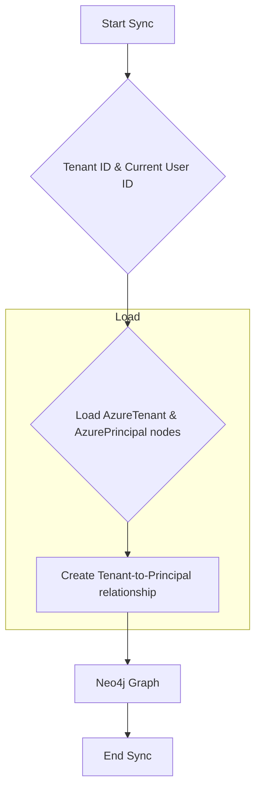

# Technical Requirements: Azure Tenant Intelligence Module

This document provides a comprehensive technical breakdown of the Azure Tenant intelligence module within Cartography. It is intended for developers who need to understand, integrate, and maintain this foundational module.

## 🏗️ Overview and Implementation Details

### Module Name and Purpose

*   **Module Name:** `cartography.intel.azure.tenant.py`
*   **Purpose:** This module is responsible for creating the root `:AzureTenant` node in the graph. It also records the specific `:AzurePrincipal` (the user or service principal) whose credentials were used to perform the Cartography sync.

### Data Flow

The module's data flow is very simple. It takes a tenant ID and the current user's ID (e.g., email address) and ensures they are represented and linked in the graph.



### Technology Stack

*   **Programming Language:** Python
*   **Core Libraries:**
    *   `neo4j`: The official Python driver for Neo4j.

### Core Logic/Algorithm

The module's `sync()` function is very direct:

1.  **`load_azure_tenant()`:** This is the core function. It runs a single Cypher query that performs a series of `MERGE` operations:
    1.  `MERGE` an `:AzureTenant` node using the provided `tenant_id`.
    2.  `MERGE` an `:AzurePrincipal` node using the `current_user`'s ID.
    3.  `MERGE` a `[:RESOURCE]` relationship from the `:AzureTenant` to the `:AzurePrincipal`.
    *   This query ensures that the tenant is created and that the principal used for the sync is present in the graph and linked to the tenant.
2.  **`cleanup()`:** After loading, a cleanup job is run. This job is configured to remove `:AzureTenant` nodes that were not touched during the current sync run. This is important in multi-tenant Cartography setups to ensure that tenants that are no longer being scanned are removed from the graph.

### Dependencies

*   **External:** `neo4j-driver`
*   **Internal (Cartography):**
    *   `.util.credentials.Credentials`: The object holding Azure credentials, used by the helper `get_tenant_id()`.
    *   `cartography.util.run_cleanup_job`: For the cleanup operation.

---

## 🏛️ Architecture and Structure

### System Integration

This is one of the most foundational modules for Azure intelligence. It creates the absolute root of the Azure resource hierarchy, the `:AzureTenant` node. All other Azure resources, starting with subscriptions, are ultimately connected back to this node. The creation of the `:AzurePrincipal` node is also important for auditing, as it clearly identifies the identity used to perform the data collection.

### Internal Components

*   **Main Entry Point:**
    *   `sync()`: Orchestrates the load and cleanup operations.
*   **Data Fetching (Helper):**
    *   `get_tenant_id()`: A simple helper to extract the tenant ID from the `Credentials` object.
*   **Data Loading:**
    *   `load_azure_tenant()`: Contains the Cypher query to load the tenant and principal into Neo4j.
*   **Cleanup:**
    *   `cleanup()`: Calls the generic cleanup job runner with the specific job file for tenants.

---

## 🔗 External Interfaces and Contracts

### A. Public Interface (API)

*   **Main Entry Point:** `sync(neo4j_session: neo4j.Session, tenant_id: str, current_user: str, update_tag: int, common_job_parameters: Dict)`
*   **Description:** Ingests a single Azure tenant and the principal used for the sync into the graph.
*   **Side Effects:**
    *   Writes/updates an `:AzureTenant` node and an `:AzurePrincipal` node.
    *   Creates/updates a `[:RESOURCE]` relationship between them.
    *   Runs a cleanup job, which may delete stale `:AzureTenant` nodes.

### B. Input Specification

*   **`neo4j_session`**: An active `neo4j.Session` object. (Required)
*   **`tenant_id`**: The ID of the Azure Tenant to sync. (Required)
*   **`current_user`**: The ID (email or app ID) of the principal whose credentials are being used. (Required)
*   **`update_tag`**: An `int` timestamp for versioning the sync run. (Required)
*   **`common_job_parameters`**: A `Dict` containing metadata for the cleanup job. (Required)
*   **Input Sources:** Called by the main Azure sync orchestrator at the very beginning of a sync run.

### C. Output Specification

*   **Output Data Structure:** Returns `None`. Its output is the state change in the Neo4j database.
*   **Error Handling:** This module has minimal error handling as it does not perform any fallible API calls during its main `sync` workflow. The inputs are expected to be valid.

---

## 🎯 Use Cases and Scenarios

*   **Use Case 1: Identify All Tenants Scanned by Cartography**
    *   **Scenario:** In a large enterprise with many tenants, an administrator wants a definitive list of which tenants are being scanned.
    *   **Integration:** A simple query to find all nodes with the `:AzureTenant` label.
        ```cypher
        MATCH (t:AzureTenant) RETURN t.id
        ```

*   **Use Case 2: Audit Sync Credentials**
    *   **Scenario:** A security team needs to know which principal account is being used to run the Cartography Azure sync.
    *   **Integration:** The relationship created by this module provides a direct answer.
        ```cypher
        MATCH (t:AzureTenant)-[:RESOURCE]->(p:AzurePrincipal)
        RETURN t.id, p.id
        ```
