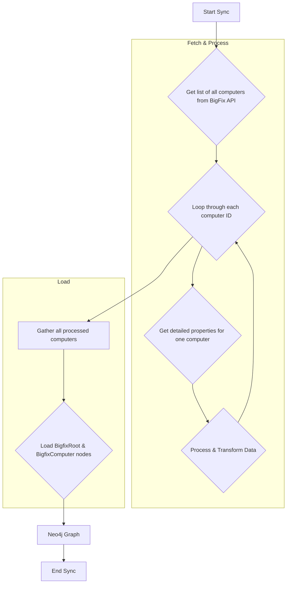

# Technical Requirements: BigFix Computers Intelligence Module

This document provides a comprehensive technical breakdown of the BigFix Computers intelligence module within Cartography. It is intended for developers who need to understand, integrate, and maintain this module.

## 🏗️ Overview and Implementation Details

### Module Name and Purpose

*   **Module Name:** `cartography.intel.bigfix.computers.py`
*   **Purpose:** This module connects to a BigFix (now HCL BigFix) instance, retrieves detailed information about all managed computers (endpoints), and ingests that data into the Cartography graph.

### Data Flow

The module follows a multi-step process to fetch and load data. It first retrieves a list of all computers and then iterates through that list to gather detailed properties for each one.



### Technology Stack

*   **Programming Language:** Python
*   **Core Libraries:**
    *   `requests`: To make HTTP API calls to the BigFix server.
    *   `xmltodict`: The BigFix API returns XML, so this library is used to parse it into a more usable Python dictionary.
    *   `neo4j`: The official Python driver for Neo4j.

### Core Logic/Algorithm

1.  **Authentication:** The `sync()` function begins by creating the necessary HTTP headers for Basic Authentication using the provided username and password.
2.  **Data Fetching (`get`):**
    *   `get_computer_list()` is called to make an API request to the `/api/computers` endpoint. This retrieves a list of all computers with their ID and last report time.
    *   The code then iterates through this list. For each computer ID, it calls `get_computer_details()`.
    *   `get_computer_details()` makes an API request to the `/api/computer/{id}` endpoint to get all properties for that specific machine.
    *   The properties are filtered against a `computer_keys` set to only process relevant data.
3.  **Data Transformation:**
    *   Property names from the API, which contain spaces (e.g., "Computer Name"), are transformed into a Neo4j-friendly format by removing the spaces (e.g., "ComputerName").
    *   String timestamps (`Last Report Time`, `Enrollment Date`) are parsed into proper `datetime` objects.
    *   Boolean-like strings (`Locked`, `Remote Desktop Enabled`) are converted to actual boolean values.
4.  **Data Loading (`load_computers`):**
    *   A single `:BigfixRoot` node is created to act as the central anchor for all BigFix data.
    *   The processed list of computer data is passed to Cartography's generic `load()` function along with the `BigfixComputerSchema`. This handles the transaction of writing the `:BigfixComputer` nodes and linking them to the `:BigfixRoot`.
5.  **Cleanup:** A `GraphJob` is run to remove any `:BigfixComputer` nodes that were not updated during the current sync, ensuring that decommissioned endpoints are removed from the graph.

### Dependencies

*   **External:** `requests`, `xmltodict`
*   **Internal (Cartography):**
    *   `cartography.client.core.tx.load`: The generic data loading function.
    *   `cartography.graph.job.GraphJob`: Used for cleanup.
    *   `cartography.models.bigfix.*`: The data models and schemas for `:BigfixRoot` and `:BigfixComputer`.

---

## 🏛️ Architecture and Structure

### System Integration

This module enriches the graph with endpoint data from BigFix. This is highly valuable for correlating infrastructure information (like AWS EC2 instances or GCP Compute Engines) with endpoint management and security posture data. For example, one could query for cloud instances that do *not* have a corresponding `BigfixComputer` node, indicating a potential gap in management coverage.

### Internal Components

*   **Top-Level Orchestrator:**
    *   `sync()`: The main entry point that orchestrates the entire get, load, and cleanup process.
*   **Data Fetching:**
    *   `get()`: The top-level function for fetching and processing all computer data.
    *   `get_computer_list()` -> `_get_computer_list_raw_xml()`: Fetches the raw XML list of all computers.
    *   `get_computer_details()` -> `_get_computer_details_raw_xml()`: Fetches the raw XML details for a single computer.
*   **Data Loading:**
    *   `load_computers()`: Prepares and executes the load operation using the generic loader.
*   **Cleanup:**
    *   `cleanup()`: Runs the standard graph cleanup job for the computer schema.
*   **Utilities:**
    *   `_get_headers()`: A helper function to prepare authentication headers.

---

## 🔗 External Interfaces and Contracts

### A. Public Interface (API)

*   **Main Entry Point:** `sync(neo4j_session: neo4j.Session, bigfix_root_url: str, bigfix_username: str, bigfix_password: str, update_tag: int, common_job_parameters: Dict, computer_keys: Optional[Set[str]] = None)`
*   **Description:** Orchestrates the complete discovery and synchronization of BigFix computers.
*   **Side Effects:**
    *   Writes a `:BigfixRoot` node.
    *   Writes `:BigfixComputer` nodes for all discovered endpoints.
    *   Creates `[:RESOURCE]` relationships from the root to the computers.
    *   Runs a cleanup job that may delete stale `:BigfixComputer` nodes.

### B. Input Specification

*   **`neo4j_session`**: An active `neo4j.Session` object. (Required)
*   **`bigfix_root_url`**: The base URL for the BigFix API (e.g., `https://bigfix.example.com`). (Required)
*   **`bigfix_username`**: The username for API authentication. (Required)
*   **`bigfix_password`**: The password for API authentication. (Required)
*   **`update_tag`**: The timestamp for the sync run. (Required)
*   **`common_job_parameters`**: A dictionary for the cleanup job. (Required)
*   **`computer_keys`**: An optional `Set[str]` to specify which computer properties to sync. If not provided, a default set is used.

### C. Output Specification

*   **Output Data Structure:** Returns `None`. Its output is the state change in the Neo4j database.
*   **Error Handling:** The underlying `requests.get` calls will raise an `HTTPError` if the BigFix API returns a non-200 status code. The module does not handle this, so a failure in an API call will stop the sync for this module. The `xmltodict.parse` could also fail if the API returns malformed XML.

---

## 🎯 Use Cases and Scenarios

*   **Use Case 1: Inventory All Managed Endpoints**
    *   **Scenario:** A security operator wants a complete list of all endpoints managed by BigFix.
    *   **Integration:** A direct query on the nodes created by this module.
        ```cypher
        MATCH (c:BigfixComputer) RETURN c.ComputerName, c.OS, c.IPAddress, c.LastReportTime
        ```

*   **Use Case 2: Find Computers That Haven't Reported Recently**
    *   **Scenario:** An IT administrator needs to identify computers that may be offline or have a broken BigFix agent.
    *   **Integration:** The `LastReportDateTime` property can be used to find stale records.
        ```cypher
        // Find computers that haven't checked in for 30 days
        MATCH (c:BigfixComputer)
        WHERE c.LastReportDateTime < (datetime() - duration({days: 30}))
        RETURN c.ComputerName, c.LastReportTime, c.LoggedonUser
        ```

*   **Use Case 3: Identify Endpoints with Low Disk Space**
    *   **Scenario:** A support technician wants to proactively find computers with low disk space to prevent user issues.
    *   **Integration:** The `FreeSpaceonSystemDrive` and `TotalSizeofSystemDrive` properties can be used for this analysis.
        ```cypher
        MATCH (c:BigfixComputer)
        WHERE (c.FreeSpaceonSystemDrive / c.TotalSizeofSystemDrive) < 0.1 // Less than 10% free
        RETURN c.ComputerName, c.FreeSpaceonSystemDrive, c.TotalSizeofSystemDrive
        ```
