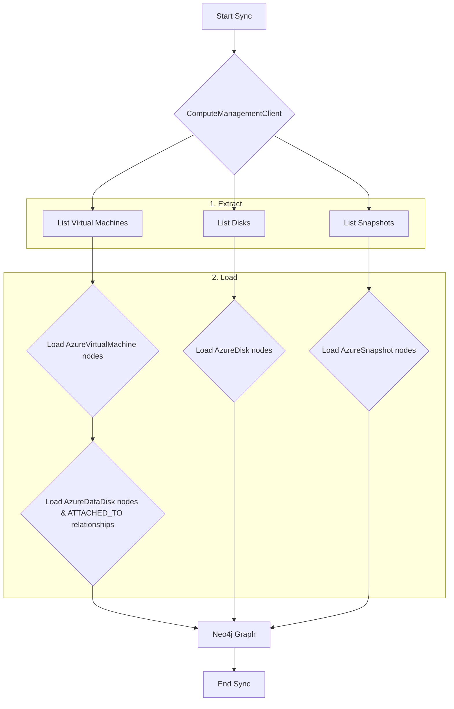

# Technical Requirements: Azure Compute Intelligence Module

This document provides a comprehensive technical breakdown of the Azure Compute intelligence module within Cartography. It is intended for developers who need to understand, integrate, and maintain this module.

## 🏗️ Overview and Implementation Details

### Module Name and Purpose

*   **Module Name:** `cartography.intel.azure.compute.py`
*   **Purpose:** This module is responsible for syncing core Azure compute resources. It discovers and models Azure Virtual Machines (`:AzureVirtualMachine`), managed disks (`:AzureDisk`), disk snapshots (`:AzureSnapshot`), and the data disks attached to VMs (`:AzureDataDisk`).

### Data Flow

The module executes a separate sync for each major resource type (VMs, Disks, Snapshots). For VMs, it also ingests their attached data disks.



### Technology Stack

*   **Programming Language:** Python
*   **Core Libraries:**
    *   `azure-mgmt-compute`: The Azure SDK for Python, used to interact with the Azure Compute Resource Provider API.
    *   `neo4j`: The official Python driver for Neo4j.

### Core Logic/Algorithm

The sync is orchestrated by the main `sync()` function, which calls three sub-sync functions:

1.  **`sync_virtual_machine()`:**
    *   Fetches all virtual machines in the subscription using `virtual_machines.list_all()`.
    *   Calls `load_vms()`, which uses `UNWIND` to batch-ingest `:AzureVirtualMachine` nodes and link them to their parent `:AzureSubscription`.
    *   `load_vms()` then iterates through the fetched VMs. If a VM has data disks, it calls `load_vm_data_disks()`.
    *   `load_vm_data_disks()` ingests the attached disks as `:AzureDataDisk` nodes and creates an `[:ATTACHED_TO]` relationship from the parent `:AzureVirtualMachine`.
    *   Finally, a cleanup job is run to remove stale VM data.

2.  **`sync_disk()`:**
    *   Fetches all managed disks in the subscription using `disks.list()`.
    *   Calls `load_disks()` to ingest them as `:AzureDisk` nodes, linked to the parent `:AzureSubscription`.
    *   Runs a cleanup job to remove stale disk nodes.

3.  **`sync_snapshot()`:**
    *   Fetches all disk snapshots in the subscription using `snapshots.list()`.
    *   Calls `load_snapshots()` to ingest them as `:AzureSnapshot` nodes, linked to the parent `:AzureSubscription`.
    *   Runs a cleanup job to remove stale snapshot nodes.

**Note on Disk Modeling:** The module uses two distinct node labels for disks. `:AzureDisk` represents a managed disk as a top-level resource in the subscription. `:AzureDataDisk` represents a disk specifically in its role as an attachment to a VM, holding attachment-specific properties like the LUN (Logical Unit Number). A disk that is attached to a VM will be represented by both a `:AzureDisk` node and a `:AzureDataDisk` node, linked by their common resource ID.

### Dependencies

*   **External:** `azure-mgmt-compute`, `neo4j-driver`
*   **Internal (Cartography):**
    *   `.util.credentials.Credentials`: The object holding Azure credentials.
    *   `cartography.util.run_cleanup_job`: For all cleanup operations.

---

## 🏛️ Architecture and Structure

### System Integration

This module provides the foundational asset inventory for Azure compute resources. The `:AzureVirtualMachine` nodes it creates are central, serving as anchor points for other modules that might inspect VM network configurations, vulnerabilities, or installed software.

### Internal Components

*   **Main Entry Point:**
    *   `sync()`: Orchestrates the three sub-syncs.
*   **Sub-Sync Functions:**
    *   `sync_virtual_machine()`, `sync_disk()`, `sync_snapshot()`: Each handles the get, load, and cleanup for a specific resource type.
*   **Data Fetching:**
    *   `get_vm_list()`, `get_disks()`, `get_snapshots_list()`: Use the Azure SDK to fetch raw resource data.
*   **Data Loading:**
    *   `load_vms()`, `load_vm_data_disks()`, `load_disks()`, `load_snapshots()`: Contain the Cypher queries to load data into Neo4j.
*   **Cleanup:**
    *   `cleanup_virtual_machine()`, `cleanup_disks()`, `cleanup_snapshot()`: Call the generic cleanup job runner with specific job files.

---

## 🔗 External Interfaces and Contracts

### A. Public Interface (API)

*   **Main Entry Point:** `sync(neo4j_session: neo4j.Session, credentials: Credentials, subscription_id: str, update_tag: int, common_job_parameters: Dict)`
*   **Description:** Orchestrates the complete discovery and synchronization of Azure VMs, disks, and snapshots for a given subscription.
*   **Side Effects:**
    *   Writes/updates `:AzureVirtualMachine`, `:AzureDataDisk`, `:AzureDisk`, and `:AzureSnapshot` nodes in the Neo4j graph.
    *   Creates `:RESOURCE` and `:ATTACHED_TO` relationships.
    *   Runs cleanup jobs, which may delete stale nodes and relationships for these types.

### B. Input Specification

*   **`neo4j_session`**: An active `neo4j.Session` object. (Required)
*   **`credentials`**: An Azure `Credentials` object. (Required)
*   **`subscription_id`**: The ID of the Azure subscription to scan. (Required)
*   **`update_tag`**: An `int` timestamp for versioning the sync run. (Required)
*   **`common_job_parameters`**: A `Dict` containing metadata for the cleanup jobs. (Required)
*   **Input Sources:** Called by the main Azure sync orchestrator.

### C. Output Specification

*   **Output Data Structure:** Returns `None`. Its output is the state change in the Neo4j database.
*   **Error Handling:** All data fetching functions (`get_*`) are wrapped in a `try...except HttpResponseError` block. If the API returns an error (e.g., due to permissions), a warning is logged, and an empty list is returned, allowing the sync to continue gracefully.

---

## 🎯 Use Cases and Scenarios

*   **Use Case 1: Comprehensive VM Inventory**
    *   **Scenario:** An administrator needs a list of all virtual machines in a specific location, including their size and OS.
    *   **Integration:** A Cypher query on the graph can quickly produce this inventory:
        ```cypher
        MATCH (sub:AzureSubscription)-[:RESOURCE]->(vm:AzureVirtualMachine)
        WHERE sub.id = '/subscriptions/your-sub-id' AND vm.location = 'eastus'
        RETURN vm.name, vm.size, vm.computer_name
        ```

*   **Use Case 2: Identify Unencrypted Disks and Snapshots**
    *   **Scenario:** A security engineer needs to find all managed disks and snapshots that do not have encryption enabled, which may violate a security policy.
    *   **Integration:** The `encryption` property on the nodes makes this a simple query:
        ```cypher
        // Find unencrypted disks
        MATCH (disk:AzureDisk) WHERE disk.encryption = false
        RETURN disk.id, disk.name, disk.resourcegroup

        // Find unencrypted snapshots
        MATCH (snap:AzureSnapshot) WHERE snap.encryption = false
        RETURN snap.id, snap.name, snap.resourcegroup
        ```

*   **Use Case 3: Map VMs to their Attached Data Disks**
    *   **Scenario:** A sysadmin is investigating a performance issue on a VM and needs to see all of its attached data disks, their sizes, and their LUNs.
    *   **Integration:** The `ATTACHED_TO` relationship directly models this connection:
        ```cypher
        MATCH (vm:AzureVirtualMachine {name: 'my-prod-vm'})-[:ATTACHED_TO]->(disk:AzureDataDisk)
        RETURN vm.name, disk.name, disk.size, disk.lun, disk.caching
        ```
