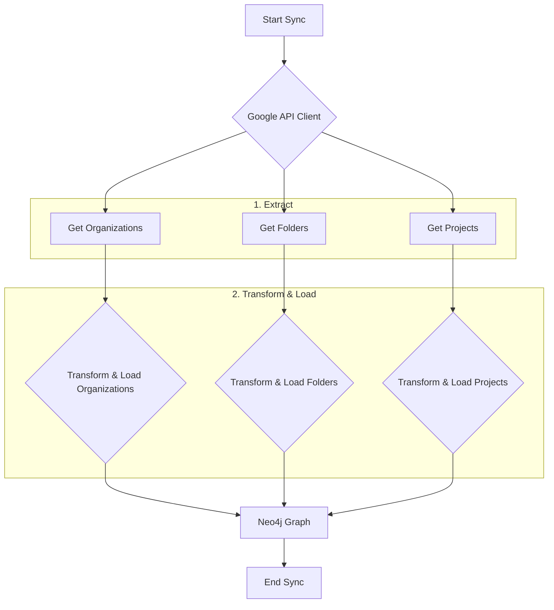
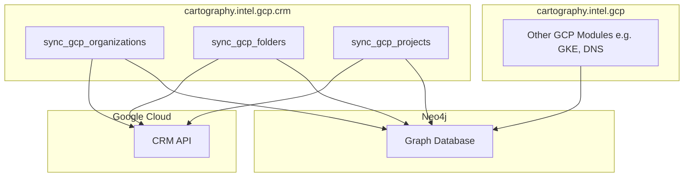

# Technical Requirements: GCP Cloud Resource Manager (CRM) Intelligence Module

This document provides a comprehensive technical breakdown of the GCP Cloud Resource Manager (CRM) intelligence module within Cartography. It is intended for developers who need to understand, integrate, and maintain this foundational piece of the GCP sync.

## 🏗️ Overview and Implementation Details

### Module Name and Purpose

*   **Module Name:** `cartography.intel.gcp.crm.py`
*   **Purpose:** The primary objective of this module is to discover the Google Cloud Platform (GCP) resource hierarchy for a given set of credentials. It retrieves organizations, folders, and projects and models them as a graph in Neo4j. This hierarchy is the backbone for all other GCP resource discovery.

### Data Flow

The module discovers the GCP resource hierarchy in a top-down fashion, starting with organizations, then folders, and finally projects.



### Technology Stack

*   **Programming Language:** Python
*   **Core Libraries:**
    *   `google-api-python-client`: The Google API Client Library for Python, used to interact with the Cloud Resource Manager API.
    *   `neo4j`: The official Python driver for Neo4j.

### Core Logic/Algorithm

1.  **Discover Organizations, Folders, and Projects:** The module uses the `crm_v1` and `crm_v2` API resources to list all accessible organizations, folders, and projects. It handles pagination for project discovery.
2.  **Load Hierarchy:** Each resource type (Organization, Folder, Project) is loaded into the Neo4j graph with a specific label (`:GCPOrganization`, `:GCPFolder`, `:GCPProject`).
3.  **Establish Relationships:** The module correctly establishes the parent-child relationships between these resources. For example, a `GCPProject` is linked to its parent `GCPFolder` or `GCPOrganization` with a `[:RESOURCE]` relationship. This reconstructs the GCP resource hierarchy within the graph.
4.  **Cleanup:** For each resource type, a cleanup job is run to remove stale nodes from the graph that were not discovered in the current sync cycle.

### Dependencies

*   **External:** `google-api-python-client`, `neo4j-driver`
*   **Internal (Cartography):**
    *   `cartography.util`: For common utilities like `timeit` and `run_cleanup_job`.

---

## 🏛️ Architecture and Structure

### System Integration

The CRM module is the entry point for the GCP sync. It establishes the foundational hierarchy that all other GCP modules depend on. For example, the GKE (Google Kubernetes Engine) module will first query the graph for all `:GCPProject` nodes and then iterate through them to discover GKE clusters within each project.

### Internal Components

*   **Main Sync Functions:**
    *   `sync_gcp_organizations()`, `sync_gcp_folders()`, `sync_gcp_projects()`: These functions orchestrate the sync for each specific resource type by calling the appropriate get, load, and cleanup functions.
*   **Data Fetching Functions (`get_*`):**
    *   `get_gcp_organizations()`, `get_gcp_folders()`, `get_gcp_projects()`: These functions make the API calls to the GCP CRM API to retrieve the raw resource data.
*   **Data Loading Functions (`load_*`):**
    *   `load_gcp_organizations()`, `load_gcp_folders()`, `load_gcp_projects()`: These functions take the raw data from the `get_*` functions and execute Cypher queries to load it into Neo4j.
    *   `_attach_gcp_project_parent()`: A helper function specifically for creating the relationship between a project and its parent.
*   **Cleanup Functions (`cleanup_*`):**
    *   `cleanup_gcp_organizations()`, `cleanup_gcp_folders()`, `cleanup_gcp_projects()`: These functions run the cleanup jobs to ensure the graph reflects the current state of the GCP environment.

### Mermaid.js Diagram: Component Interactions


The diagram illustrates that the CRM module is responsible for fetching hierarchy data from the GCP API and loading it into the graph. Other GCP modules then use this foundational data to scope their own discovery tasks.

---

## 🔗 External Interfaces and Contracts

### A. Public Interface (API)

The module exposes three main sync functions, one for each level of the hierarchy.

*   `sync_gcp_organizations(neo4j_session: neo4j.Session, crm_v1: Resource, gcp_update_tag: int, common_job_parameters: Dict)`
*   `sync_gcp_folders(neo4j_session: neo4j.Session, crm_v2: Resource, gcp_update_tag: int, common_job_parameters: Dict)`
*   `sync_gcp_projects(neo4j_session: neo4j.Session, projects: List[Dict], gcp_update_tag: int, common_job_parameters: Dict)`

*   **Description:** These functions are called by the main GCP sync orchestrator. They handle the complete synchronization for their respective resource types.
*   **Side Effects:**
    *   Writes nodes and relationships for Organizations, Folders, and Projects to the Neo4j database.
    *   Runs cleanup jobs, potentially deleting stale nodes and relationships.

### B. Input Specification

*   **`neo4j_session`**: An active `neo4j.Session` object. (Required)
*   **`crm_v1` / `crm_v2`**: An authenticated `Resource` object for the Cloud Resource Manager API, created by `googleapiclient.discovery.build()`. (Required)
*   **`projects`**: For `sync_gcp_projects`, a `List[Dict]` of project data, typically from `get_gcp_projects()`. (Required)
*   **`gcp_update_tag`**: An `int` timestamp used to version the data from the current sync run. (Required)
*   **`common_job_parameters`**: A `Dict` containing metadata for the cleanup jobs. (Required)
*   **Input Sources:** These functions are called by the main GCP sync loop in Cartography.

### C. Output Specification

*   **Output Data Structure:** All `sync_*` functions return `None`. Their output is the modification of the Neo4j database.
*   **Error Handling:**
    *   The `get_*` functions are wrapped in a `try...except HttpError` block. If an API error occurs (e.g., due to lack of permissions), a warning is logged, and an empty list is returned to prevent the sync from crashing.

---

## 🎯 Use Cases and Scenarios

*   **Use Case 1: Enabling All Other GCP Modules (Internal)**
    *   **Scenario:** The GCS (Google Cloud Storage) module needs to discover all storage buckets.
    *   **Integration:** The GCS module must first get a list of all projects to scan. It does this by querying the graph for nodes created by the CRM module: `MATCH (p:GCPProject) RETURN p.id`. This is the foundational use case for the CRM module.

*   **Use Case 2: Hierarchical Asset Inventory**
    *   **Scenario:** A cloud security architect wants to see the full resource hierarchy, from the organization down to the projects.
    *   **Integration:** The architect can run a Cypher query on the graph populated by this module to visualize the entire structure:
        ```cypher
        MATCH (o:GCPOrganization)-[:RESOURCE*]->(p:GCPProject)
        RETURN o.displayname, p.projectid
        ```

*   **Use Case 3: Scoping Security Scans**
    *   **Scenario:** A compliance team wants to run a security scan only on projects within a specific "Production" folder.
    *   **Integration:** The team can first identify the target projects by querying the graph and then use that list to scope their scanning tools.
        ```cypher
        MATCH (f:GCPFolder{displayname: 'Production'})-[:RESOURCE*]->(p:GCPProject)
        RETURN p.projectid
        ```
