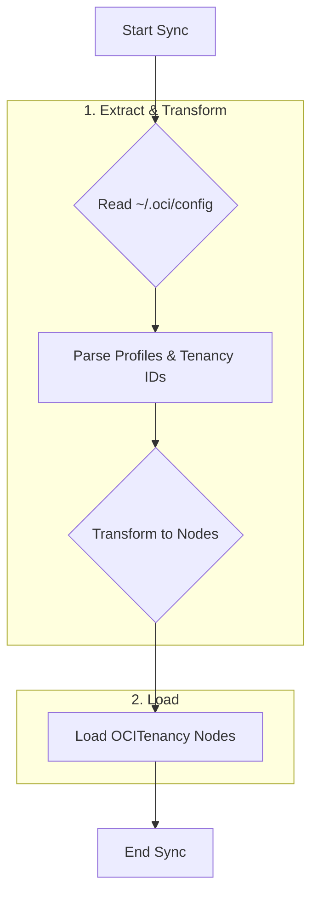
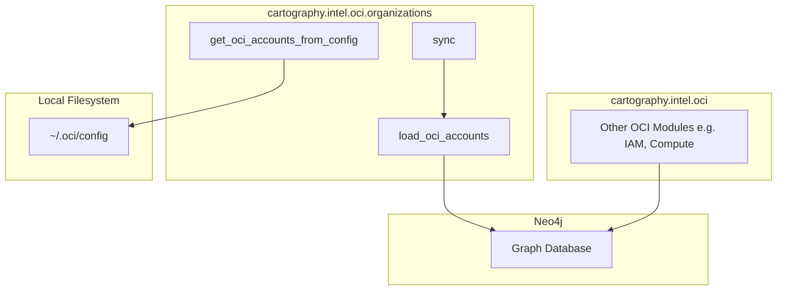

# Technical Requirements: OCI Organizations Intelligence Module

This document provides a comprehensive technical breakdown of the OCI Organizations intelligence module within Cartography. It is intended for developers who need to understand, integrate, and maintain this foundational piece of the OCI sync.

## 🏗️ Overview and Implementation Details

### Module Name and Purpose

*   **Module Name:** `cartography.intel.oci.organizations.py`
*   **Purpose:** The primary objective of this module is to discover and model Oracle Cloud Infrastructure (OCI) tenancies. It reads OCI configuration files to identify available profiles and their associated tenancies, then loads them into a Neo4j graph.

### Data Flow

The module extracts tenancy information from local OCI configuration files and loads this data into the Neo4j graph, establishing the root nodes for the OCI resource hierarchy.



### Technology Stack

*   **Programming Language:** Python
*   **Core Libraries:**
    *   `oci`: The Oracle Cloud Infrastructure SDK for Python, used to read and validate configuration files.
    *   `neo4j`: The official Python driver for Neo4j.

### Core Logic/Algorithm

1.  **Read Configuration:** The module reads the OCI configuration file (typically located at `~/.oci/config`).
2.  **Parse Profiles:** It parses the file to identify all configured profiles (e.g., `[DEFAULT]`, `[PROFILE_NAME]`).
3.  **Validate Profiles:** For each profile, it uses the OCI SDK to validate the configuration and extract the associated tenancy OCID.
4.  **Handle Errors:** It includes robust error handling to manage scenarios like a missing config file, an invalid profile, or a profile that cannot be validated.
5.  **Load Tenancies:** The discovered tenancy OCIDs and their associated profile names are loaded into the Neo4j graph as `OCITenancy` nodes.
6.  **Cleanup:** A cleanup job is run to remove stale `OCITenancy` nodes that were not present in the current sync run (e.g., if a profile was removed from the config file).

### Dependencies

*   **External:** `oci`, `neo4j-driver`
*   **Internal (Cartography):**
    *   `cartography.util`: For `run_cleanup_job`.

---

## 🏛️ Architecture and Structure

### System Integration

This module is the starting point for the entire OCI sync process. It establishes the top-level `OCITenancy` nodes. All other OCI modules (e.g., IAM, Compute) will query the graph to get a list of these tenancies and use the associated profiles to configure their OCI clients and scope their data collection efforts.

### Internal Components

*   **Main Entry Point:**
    *   `sync()`: The orchestrator that calls the loading and cleanup functions.
*   **Configuration & Data Fetching:**
    *   `get_oci_accounts_from_config()`: The core function that reads the config file, iterates through profiles, validates them, and returns a dictionary mapping profile names to their credentials and tenancy information.
    *   `get_oci_profile_names_from_config()`: A helper function to parse profile names from the config file.
    *   `get_oci_account_default()`: Specifically handles the `DEFAULT` profile.
*   **Data Loading & Cleanup:**
    *   `load_oci_accounts()`: Takes the tenancy data and executes the Cypher query to load it into Neo4j.
    *   `cleanup()`: Runs the cleanup job to remove stale tenancies.

### Mermaid.js Diagram: Component Interactions



The diagram shows that the `organizations` module reads from the local OCI configuration file to get tenancy data and loads it into the graph. Other OCI modules then query the graph for these tenancies to begin their own syncs.

---

## 🔗 External Interfaces and Contracts

### A. Public Interface (API)

*   **Main Entry Point:** `sync(neo4j_session: neo4j.Session, accounts: Dict[str, Any], oci_update_tag: int, common_job_parameters: Dict[str, Any])`
*   **Description:** This is the primary function for external invocation. It orchestrates the synchronization of OCI tenancy data based on the discovered configuration profiles.
*   **Side Effects:**
    *   Writes `OCITenancy` nodes to the Neo4j database.
    *   Runs a cleanup job, which may delete stale `OCITenancy` nodes.

### B. Input Specification

*   **`neo4j_session`**:
    *   **Structure:** An active `neo4j.Session` object.
    *   **Required:** Yes.
*   **`accounts`**:
    *   **Structure:** A `Dict[str, Any]` where keys are profile names and values are the credential objects, typically generated by `get_oci_accounts_from_config()`.
    *   **Required:** Yes.
*   **`oci_update_tag`**:
    *   **Structure:** `int` (Timestamp).
    *   **Required:** Yes.
    *   **Constraint:** Used to version the data from the current sync run.
*   **`common_job_parameters`**:
    *   **Structure:** `Dict`.
    *   **Required:** Yes.
    *   **Constraint:** Contains metadata for the cleanup job.
*   **Input Sources:** The `sync` function is called by the main OCI sync loop in Cartography. The `accounts` dictionary is provided by calling `get_oci_accounts_from_config()` in the same module.

### C. Output Specification

*   **Output Data Structure:** The function returns `None`. Its output is the state change in the Neo4j database.
*   **Error Handling:**
    *   The `get_*` functions are wrapped in `try...except` blocks to catch `ConfigFileNotFound`, `ProfileNotFound`, and `InvalidConfig` errors from the OCI SDK. It logs a detailed error message and continues or returns an empty dictionary to prevent a crash.

---

## 🎯 Use Cases and Scenarios

*   **Use Case 1: Bootstrapping the OCI Sync (Internal)**
    *   **Scenario:** The OCI IAM module needs to discover all users and groups in a tenancy.
    *   **Integration:** The IAM module first queries the graph to get the tenancy OCIDs and their associated profile names: `MATCH (t:OCITenancy) RETURN t.ocid, t.name`. It then uses this information to create an authenticated OCI client for the correct tenancy and begins its data collection.

*   **Use Case 2: Multi-Tenancy Inventory**
    *   **Scenario:** A cloud administrator manages multiple OCI tenancies via different profiles in their config file and needs a single place to see all of them.
    *   **Integration:** After a Cartography sync, the administrator can query the graph to get a unified list of all discovered tenancies:
        ```cypher
        MATCH (t:OCITenancy)
        RETURN t.name, t.ocid
        ```
        This provides a simple, consolidated inventory without needing to manually inspect the config file or run OCI CLI commands for each profile.
