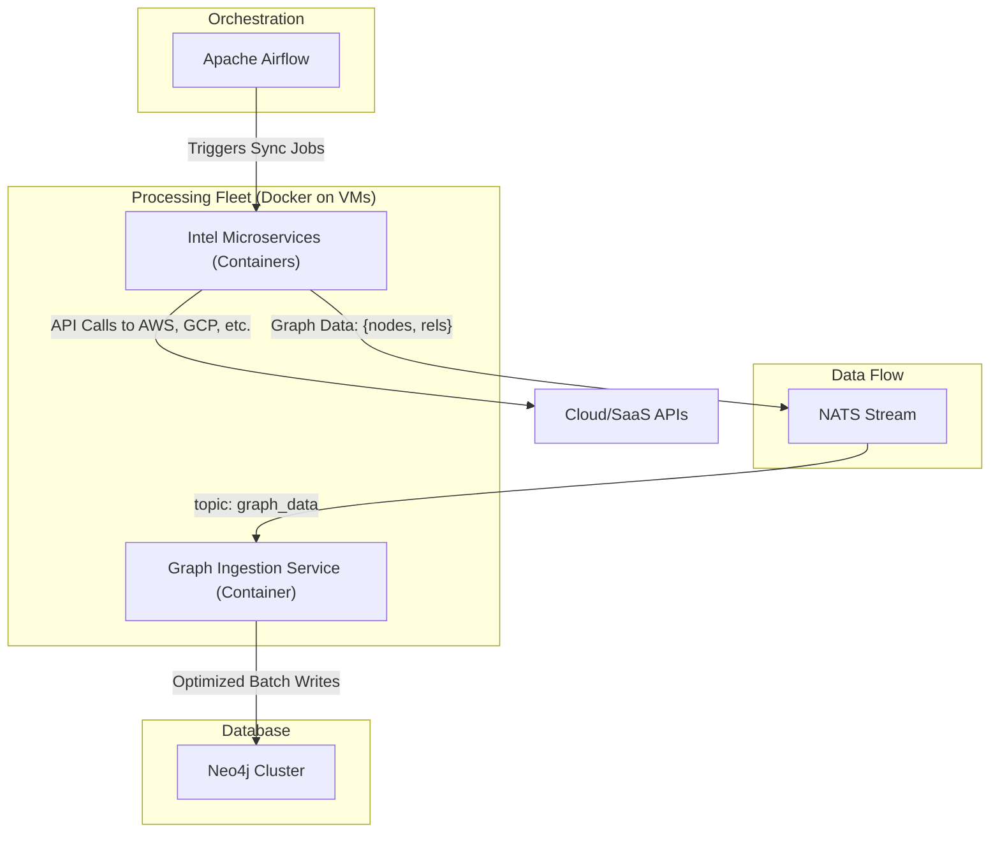

# Cartography-Next-Gen: A Scalable, Open-Source Architecture

*   **Authors**: Marco Lancini, AWS
*   **Version**: 0.4
*   **Status**: Draft

## 1. Abstract

This document proposes a new, next-generation architecture for the Cartography project. The goal is to create a scalable, resilient, and extensible system using a fully open-source technology stack. This approach avoids vendor lock-in and provides the flexibility to deploy on any cloud provider or on-premises. The architecture moves from a monolithic structure to a distributed system of containerized microservices orchestrated by Apache Airflow.

## 2. The Problem: Monolithic Architecture and Scalability Limits

The current architecture of Cartography is monolithic, which leads to performance bottlenecks, a lack of resilience, and difficulty in extending the system. As environments grow, these limitations become more pronounced.

## 3. The Solution: A Distributed, Open-Source Architecture

We propose re-architecting Cartography into a set of distributed microservices that communicate via a message queue. This design decouples the main components, allowing them to be scaled, deployed, and maintained independently using open-source technologies.

### 3.1. Core Components

1.  **Orchestration (Apache Airflow)**: A powerful, open-source workflow management platform that will schedule and manage the execution of sync jobs.

2.  **Message Queue (NATS Stream)**: A lightweight, high-performance, open-source messaging system that enables asynchronous communication between services.

3.  **Intel Microservices (Docker Containers)**: A fleet of small, independent services, each responsible for a single intel task. They are packaged as Docker containers and consume jobs from the message queue, perform API calls, and publish the raw results back to the queue.

4.  **Graph Ingestion Service (Docker Container)**: This service, also a Docker container, consumes processed data from the queue, performs the final transformation, generates optimized Cypher queries, and batches the writes to the Neo4j database.

### 3.2. Advantages of the New Architecture

*   **No Vendor Lock-In**: The entire stack is open-source, providing the freedom to run the application on any cloud or on-premises infrastructure.
*   **Cost-Effective**: Leverages open-source software, eliminating licensing fees. Can be run on commodity hardware or the most cost-effective VM instances.
*   **Scalability**: The containerized microservices can be scaled horizontally by running more instances on additional VMs as needed.
*   **Flexibility & Control**: Provides full control over the entire application stack and deployment environment.

### 3.3. Proposed Architecture Diagram

## 4. Project Breakdown: Phases and Tasks

This project will be executed in three phases:

### Phase 1: Foundation and Core Services

*   **Task 1.1: Set up Infrastructure**: Provision virtual machines for the core components.
*   **Task 1.2: Deploy NATS Stream**: Install and configure NATS Stream for inter-service communication.
*   **Task 1.3: Deploy Apache Airflow**: Install and configure Airflow to orchestrate the data collection workflows.
*   **Task 1.4: Develop Graph Ingestion Service**: Containerize the service that consumes processed data from the message queue and writes it to Neo4j.

### Phase 2: Intel Microservice Development

*   **Task 2.1: Develop AWS EC2 Intel Microservice**: Create the first intel microservice as a Docker container.
*   **Task 2.2: Develop GCP Storage Intel Microservice**: Create a second intel microservice for GCP to prove multi-cloud capability.
*   **Task 2.3: Establish Microservice Template**: Create a standardized template for building new intel microservices, including Dockerfiles, CI/CD pipelines, and documentation.

### Phase 3: Testing, Deployment, and Migration

*   **Task 3.1: End-to-End Testing**: Conduct comprehensive testing of the new architecture.
*   **Task 3.2: Documentation and Training**: Create detailed documentation for developers and operators.
*   **Task 3.3: Migration Plan**: Develop a phased migration strategy from the monolithic architecture to the new system.

## 5. Requirements

All source codes and related docs must be stored under "_docs". This PoC will be independent from the original source of cartography.
