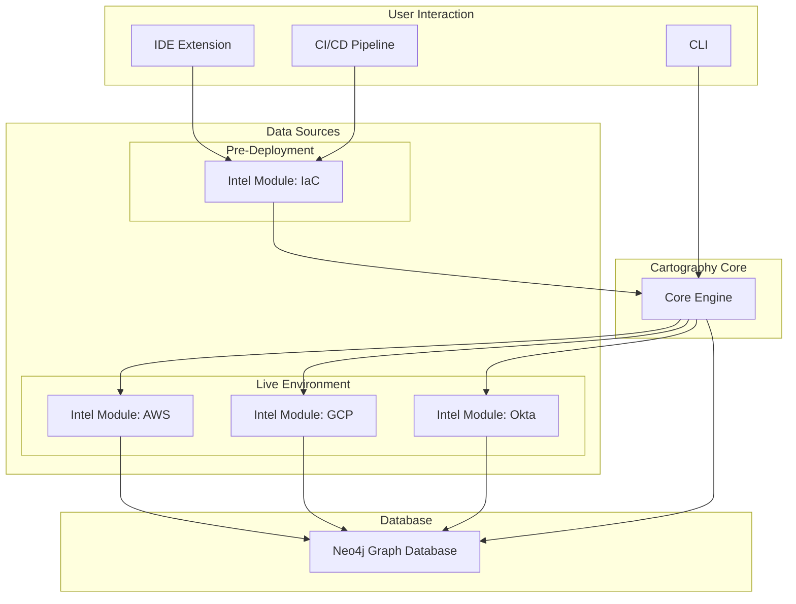

# A Radical New Strategy: Proactive, Developer-Centric Security

## The Vision: Shifting Left

Currently, Cartography excels at providing visibility into *existing* infrastructure. The next evolutionary step is to shift our focus "left" – integrating security analysis directly into the development lifecycle. Instead of merely mapping what is, we will empower developers and security teams to proactively model and secure what *will be*.

This strategy transforms Cartography from a reactive auditing tool into a proactive, preventative security platform.

## Core Pillars of the New Strategy

This vision will be realized through three core pillars:

### 1. Infrastructure-as-Code (IaC) Scanning & Modeling

We will extend Cartography to parse and model Infrastructure-as-Code files (e.g., Terraform, CloudFormation, Kubernetes YAML).

*   **How it Works:** Before deployment, a new "IaC Intel Module" will analyze these files. Instead of live APIs, the source of truth will be the code itself. This module will project the planned infrastructure onto the graph.
*   **User Benefit:** Identify potential misconfigurations, security risks, and policy violations *before* they ever reach production. This drastically reduces the cost and effort of remediation.

### 2. "What-If" Scenario Simulation

This powerful feature will allow users to see the future. By feeding IaC changes into Cartography, users can simulate their impact on the existing infrastructure graph.

*   **How it Works:** The IaC module will create a "proposed" state of the graph. Users can then run queries to compare this proposed state against the current state, asking questions like:
    *   "What new public exposure does this change introduce?"
    *   "Does this change create a new attack path to a critical asset?"
    *   "Does this change violate our compliance policies?"
*   **User Benefit:** Make informed decisions about infrastructure changes, backed by data. Prevent unintended security consequences and get a clear blast radius analysis for every proposed change.

### 3. Real-Time IDE Integration

To truly shift left, we must meet developers where they are: the IDE. We will develop a Cartography extension for popular IDEs like VS Code.

*   **How it Works:** The extension will leverage the IaC parsing engine to provide real-time feedback to developers as they write code. It will highlight lines that introduce security risks and offer automated suggestions for safer alternatives.
*   **User Benefit:** Seamlessly integrates security into the development workflow. Empowers developers to write secure infrastructure code from the start, reducing friction with security teams and accelerating delivery.

## Architectural Implications

This new strategy requires extending the core architecture:

By embracing this developer-centric, proactive approach, Cartography can become an indispensable tool not just for understanding the present state of infrastructure, but for building a more secure future.
